<div style="text-align:center; background-color:#add8e6; padding:10px; border-radius:5px;">
    <h2 style="color:#000;">Quantium Virtual Internship - Retail Strategy and Analytics - Task 1</h2>
</div>


```python
import pandas as pd
import numpy as np

import seaborn as sns
import matplotlib.pyplot as plt

import re ## For data cleaning of string variables
from scipy import stats     # For hypothesis testing
```


```python
purchase = pd.read_csv('QVI_purchase_behaviour.csv')
transaction = pd.read_excel('QVI_transaction_data.xlsx')
```


```python
transaction['DATE'] = pd.to_datetime(transaction['DATE'], unit='D', origin='1899-12-30')
```


```python
purchase.head()
```


<div>
<style scoped>
    .dataframe tbody tr th:only-of-type {
        vertical-align: middle;
    }

    .dataframe tbody tr th {
        vertical-align: top;
    }

    .dataframe thead th {
        text-align: right;
    }
</style>
<table border="1" class="dataframe">
  <thead>
    <tr style="text-align: right;">
      <th></th>
      <th>LYLTY_CARD_NBR</th>
      <th>LIFESTAGE</th>
      <th>PREMIUM_CUSTOMER</th>
    </tr>
  </thead>
  <tbody>
    <tr>
      <th>0</th>
      <td>1000</td>
      <td>YOUNG SINGLES/COUPLES</td>
      <td>Premium</td>
    </tr>
    <tr>
      <th>1</th>
      <td>1002</td>
      <td>YOUNG SINGLES/COUPLES</td>
      <td>Mainstream</td>
    </tr>
    <tr>
      <th>2</th>
      <td>1003</td>
      <td>YOUNG FAMILIES</td>
      <td>Budget</td>
    </tr>
    <tr>
      <th>3</th>
      <td>1004</td>
      <td>OLDER SINGLES/COUPLES</td>
      <td>Mainstream</td>
    </tr>
    <tr>
      <th>4</th>
      <td>1005</td>
      <td>MIDAGE SINGLES/COUPLES</td>
      <td>Mainstream</td>
    </tr>
  </tbody>
</table>
</div>


```python
transaction.head()
```


<div>
<style scoped>
    .dataframe tbody tr th:only-of-type {
        vertical-align: middle;
    }

    .dataframe tbody tr th {
        vertical-align: top;
    }

    .dataframe thead th {
        text-align: right;
    }
</style>
<table border="1" class="dataframe">
  <thead>
    <tr style="text-align: right;">
      <th></th>
      <th>DATE</th>
      <th>STORE_NBR</th>
      <th>LYLTY_CARD_NBR</th>
      <th>TXN_ID</th>
      <th>PROD_NBR</th>
      <th>PROD_NAME</th>
      <th>PROD_QTY</th>
      <th>TOT_SALES</th>
    </tr>
  </thead>
  <tbody>
    <tr>
      <th>0</th>
      <td>2018-10-17</td>
      <td>1</td>
      <td>1000</td>
      <td>1</td>
      <td>5</td>
      <td>Natural Chip        Compny SeaSalt175g</td>
      <td>2</td>
      <td>6.0</td>
    </tr>
    <tr>
      <th>1</th>
      <td>2019-05-14</td>
      <td>1</td>
      <td>1307</td>
      <td>348</td>
      <td>66</td>
      <td>CCs Nacho Cheese    175g</td>
      <td>3</td>
      <td>6.3</td>
    </tr>
    <tr>
      <th>2</th>
      <td>2019-05-20</td>
      <td>1</td>
      <td>1343</td>
      <td>383</td>
      <td>61</td>
      <td>Smiths Crinkle Cut  Chips Chicken 170g</td>
      <td>2</td>
      <td>2.9</td>
    </tr>
    <tr>
      <th>3</th>
      <td>2018-08-17</td>
      <td>2</td>
      <td>2373</td>
      <td>974</td>
      <td>69</td>
      <td>Smiths Chip Thinly  S/Cream&amp;Onion 175g</td>
      <td>5</td>
      <td>15.0</td>
    </tr>
    <tr>
      <th>4</th>
      <td>2018-08-18</td>
      <td>2</td>
      <td>2426</td>
      <td>1038</td>
      <td>108</td>
      <td>Kettle Tortilla ChpsHny&amp;Jlpno Chili 150g</td>
      <td>3</td>
      <td>13.8</td>
    </tr>
  </tbody>
</table>
</div>


- Let us look more into both dataframes and check for missing values or duplicate values


```python
purchase.isna().sum() 
```


    LYLTY_CARD_NBR      0
    LIFESTAGE           0
    PREMIUM_CUSTOMER    0
    dtype: int64


```python
transaction.isna().sum()    
```


    DATE              0
    STORE_NBR         0
    LYLTY_CARD_NBR    0
    TXN_ID            0
    PROD_NBR          0
    PROD_NAME         0
    PROD_QTY          0
    TOT_SALES         0
    dtype: int64


```python
purchase.duplicated().sum()
```


    0


```python
transaction.duplicated().sum()
```


    1


```python
transaction[transaction.duplicated()]
```


<div>
<style scoped>
    .dataframe tbody tr th:only-of-type {
        vertical-align: middle;
    }

    .dataframe tbody tr th {
        vertical-align: top;
    }

    .dataframe thead th {
        text-align: right;
    }
</style>
<table border="1" class="dataframe">
  <thead>
    <tr style="text-align: right;">
      <th></th>
      <th>DATE</th>
      <th>STORE_NBR</th>
      <th>LYLTY_CARD_NBR</th>
      <th>TXN_ID</th>
      <th>PROD_NBR</th>
      <th>PROD_NAME</th>
      <th>PROD_QTY</th>
      <th>TOT_SALES</th>
    </tr>
  </thead>
  <tbody>
    <tr>
      <th>124845</th>
      <td>2018-10-01</td>
      <td>107</td>
      <td>107024</td>
      <td>108462</td>
      <td>45</td>
      <td>Smiths Thinly Cut   Roast Chicken 175g</td>
      <td>2</td>
      <td>6.0</td>
    </tr>
  </tbody>
</table>
</div>


- There are no missing values in `purchase` and `transaction` dataframe.
- But we have one duplicate value in `trasaction` dataframe, we would drop this duplicate.


```python
transaction.drop_duplicates(inplace=True)  
```


```python
transaction.duplicated().sum()  # Dropped the duplicates
```


    0


```python
purchase.head(2)
```


<div>
<style scoped>
    .dataframe tbody tr th:only-of-type {
        vertical-align: middle;
    }

    .dataframe tbody tr th {
        vertical-align: top;
    }

    .dataframe thead th {
        text-align: right;
    }
</style>
<table border="1" class="dataframe">
  <thead>
    <tr style="text-align: right;">
      <th></th>
      <th>LYLTY_CARD_NBR</th>
      <th>LIFESTAGE</th>
      <th>PREMIUM_CUSTOMER</th>
    </tr>
  </thead>
  <tbody>
    <tr>
      <th>0</th>
      <td>1000</td>
      <td>YOUNG SINGLES/COUPLES</td>
      <td>Premium</td>
    </tr>
    <tr>
      <th>1</th>
      <td>1002</td>
      <td>YOUNG SINGLES/COUPLES</td>
      <td>Mainstream</td>
    </tr>
  </tbody>
</table>
</div>


```python
transaction.head(2)
```


<div>
<style scoped>
    .dataframe tbody tr th:only-of-type {
        vertical-align: middle;
    }

    .dataframe tbody tr th {
        vertical-align: top;
    }

    .dataframe thead th {
        text-align: right;
    }
</style>
<table border="1" class="dataframe">
  <thead>
    <tr style="text-align: right;">
      <th></th>
      <th>DATE</th>
      <th>STORE_NBR</th>
      <th>LYLTY_CARD_NBR</th>
      <th>TXN_ID</th>
      <th>PROD_NBR</th>
      <th>PROD_NAME</th>
      <th>PROD_QTY</th>
      <th>TOT_SALES</th>
    </tr>
  </thead>
  <tbody>
    <tr>
      <th>0</th>
      <td>2018-10-17</td>
      <td>1</td>
      <td>1000</td>
      <td>1</td>
      <td>5</td>
      <td>Natural Chip        Compny SeaSalt175g</td>
      <td>2</td>
      <td>6.0</td>
    </tr>
    <tr>
      <th>1</th>
      <td>2019-05-14</td>
      <td>1</td>
      <td>1307</td>
      <td>348</td>
      <td>66</td>
      <td>CCs Nacho Cheese    175g</td>
      <td>3</td>
      <td>6.3</td>
    </tr>
  </tbody>
</table>
</div>


- It can be observed that both dataframes have, `LYLTY_CARD_NBR` as a common column
- We would use this column to perform a join to form merged both dataframes into one.


```python
df = transaction.merge(purchase, on='LYLTY_CARD_NBR', how='left')

df.head()
```


<div>
<style scoped>
    .dataframe tbody tr th:only-of-type {
        vertical-align: middle;
    }

    .dataframe tbody tr th {
        vertical-align: top;
    }

    .dataframe thead th {
        text-align: right;
    }
</style>
<table border="1" class="dataframe">
  <thead>
    <tr style="text-align: right;">
      <th></th>
      <th>DATE</th>
      <th>STORE_NBR</th>
      <th>LYLTY_CARD_NBR</th>
      <th>TXN_ID</th>
      <th>PROD_NBR</th>
      <th>PROD_NAME</th>
      <th>PROD_QTY</th>
      <th>TOT_SALES</th>
      <th>LIFESTAGE</th>
      <th>PREMIUM_CUSTOMER</th>
    </tr>
  </thead>
  <tbody>
    <tr>
      <th>0</th>
      <td>2018-10-17</td>
      <td>1</td>
      <td>1000</td>
      <td>1</td>
      <td>5</td>
      <td>Natural Chip        Compny SeaSalt175g</td>
      <td>2</td>
      <td>6.0</td>
      <td>YOUNG SINGLES/COUPLES</td>
      <td>Premium</td>
    </tr>
    <tr>
      <th>1</th>
      <td>2019-05-14</td>
      <td>1</td>
      <td>1307</td>
      <td>348</td>
      <td>66</td>
      <td>CCs Nacho Cheese    175g</td>
      <td>3</td>
      <td>6.3</td>
      <td>MIDAGE SINGLES/COUPLES</td>
      <td>Budget</td>
    </tr>
    <tr>
      <th>2</th>
      <td>2019-05-20</td>
      <td>1</td>
      <td>1343</td>
      <td>383</td>
      <td>61</td>
      <td>Smiths Crinkle Cut  Chips Chicken 170g</td>
      <td>2</td>
      <td>2.9</td>
      <td>MIDAGE SINGLES/COUPLES</td>
      <td>Budget</td>
    </tr>
    <tr>
      <th>3</th>
      <td>2018-08-17</td>
      <td>2</td>
      <td>2373</td>
      <td>974</td>
      <td>69</td>
      <td>Smiths Chip Thinly  S/Cream&amp;Onion 175g</td>
      <td>5</td>
      <td>15.0</td>
      <td>MIDAGE SINGLES/COUPLES</td>
      <td>Budget</td>
    </tr>
    <tr>
      <th>4</th>
      <td>2018-08-18</td>
      <td>2</td>
      <td>2426</td>
      <td>1038</td>
      <td>108</td>
      <td>Kettle Tortilla ChpsHny&amp;Jlpno Chili 150g</td>
      <td>3</td>
      <td>13.8</td>
      <td>MIDAGE SINGLES/COUPLES</td>
      <td>Budget</td>
    </tr>
  </tbody>
</table>
</div>


```python
df.isna().sum()
```


    DATE                0
    STORE_NBR           0
    LYLTY_CARD_NBR      0
    TXN_ID              0
    PROD_NBR            0
    PROD_NAME           0
    PROD_QTY            0
    TOT_SALES           0
    LIFESTAGE           0
    PREMIUM_CUSTOMER    0
    dtype: int64


- After merging we do not have any missing values.
- But we also need to check for consistency of datatypes of all the columns.


```python
df.dtypes
```


    DATE                datetime64[ns]
    STORE_NBR                    int64
    LYLTY_CARD_NBR               int64
    TXN_ID                       int64
    PROD_NBR                     int64
    PROD_NAME                   object
    PROD_QTY                     int64
    TOT_SALES                  float64
    LIFESTAGE                   object
    PREMIUM_CUSTOMER            object
    dtype: object


```python
df['PROD_NBR'].nunique()
```


    114


```python
df['PROD_NAME'].nunique()
```


    114


```python
df['STORE_NBR'].nunique()
```


    272


```python
df['TXN_ID'].nunique()
```


    263127


- `PROD_NBR` and `PROD_NAME` are referring to same variable, we will drop `PROD_NBR` as `PROD_NAME` does a better job on this.
- We can also extract different features from `DATE` column.
- We also need to rename the columns to interpretable names.


```python
df.head()
```


<div>
<style scoped>
    .dataframe tbody tr th:only-of-type {
        vertical-align: middle;
    }

    .dataframe tbody tr th {
        vertical-align: top;
    }

    .dataframe thead th {
        text-align: right;
    }
</style>
<table border="1" class="dataframe">
  <thead>
    <tr style="text-align: right;">
      <th></th>
      <th>DATE</th>
      <th>STORE_NBR</th>
      <th>LYLTY_CARD_NBR</th>
      <th>TXN_ID</th>
      <th>PROD_NBR</th>
      <th>PROD_NAME</th>
      <th>PROD_QTY</th>
      <th>TOT_SALES</th>
      <th>LIFESTAGE</th>
      <th>PREMIUM_CUSTOMER</th>
    </tr>
  </thead>
  <tbody>
    <tr>
      <th>0</th>
      <td>2018-10-17</td>
      <td>1</td>
      <td>1000</td>
      <td>1</td>
      <td>5</td>
      <td>Natural Chip        Compny SeaSalt175g</td>
      <td>2</td>
      <td>6.0</td>
      <td>YOUNG SINGLES/COUPLES</td>
      <td>Premium</td>
    </tr>
    <tr>
      <th>1</th>
      <td>2019-05-14</td>
      <td>1</td>
      <td>1307</td>
      <td>348</td>
      <td>66</td>
      <td>CCs Nacho Cheese    175g</td>
      <td>3</td>
      <td>6.3</td>
      <td>MIDAGE SINGLES/COUPLES</td>
      <td>Budget</td>
    </tr>
    <tr>
      <th>2</th>
      <td>2019-05-20</td>
      <td>1</td>
      <td>1343</td>
      <td>383</td>
      <td>61</td>
      <td>Smiths Crinkle Cut  Chips Chicken 170g</td>
      <td>2</td>
      <td>2.9</td>
      <td>MIDAGE SINGLES/COUPLES</td>
      <td>Budget</td>
    </tr>
    <tr>
      <th>3</th>
      <td>2018-08-17</td>
      <td>2</td>
      <td>2373</td>
      <td>974</td>
      <td>69</td>
      <td>Smiths Chip Thinly  S/Cream&amp;Onion 175g</td>
      <td>5</td>
      <td>15.0</td>
      <td>MIDAGE SINGLES/COUPLES</td>
      <td>Budget</td>
    </tr>
    <tr>
      <th>4</th>
      <td>2018-08-18</td>
      <td>2</td>
      <td>2426</td>
      <td>1038</td>
      <td>108</td>
      <td>Kettle Tortilla ChpsHny&amp;Jlpno Chili 150g</td>
      <td>3</td>
      <td>13.8</td>
      <td>MIDAGE SINGLES/COUPLES</td>
      <td>Budget</td>
    </tr>
  </tbody>
</table>
</div>


```python
df['Year'] = df['DATE'].dt.year   # Year
df['Month'] = df['DATE'].dt.strftime('%B')     # Month Name
df['Day of week'] = df['DATE'].dt.strftime('%A')      # Day Name

df['Quarter'] = df['DATE'].dt.quarter      # Quarter of the year
```


```python
df.head(2)
```


<div>
<style scoped>
    .dataframe tbody tr th:only-of-type {
        vertical-align: middle;
    }

    .dataframe tbody tr th {
        vertical-align: top;
    }

    .dataframe thead th {
        text-align: right;
    }
</style>
<table border="1" class="dataframe">
  <thead>
    <tr style="text-align: right;">
      <th></th>
      <th>DATE</th>
      <th>STORE_NBR</th>
      <th>LYLTY_CARD_NBR</th>
      <th>TXN_ID</th>
      <th>PROD_NBR</th>
      <th>PROD_NAME</th>
      <th>PROD_QTY</th>
      <th>TOT_SALES</th>
      <th>LIFESTAGE</th>
      <th>PREMIUM_CUSTOMER</th>
      <th>Year</th>
      <th>Month</th>
      <th>Day of week</th>
      <th>Quarter</th>
    </tr>
  </thead>
  <tbody>
    <tr>
      <th>0</th>
      <td>2018-10-17</td>
      <td>1</td>
      <td>1000</td>
      <td>1</td>
      <td>5</td>
      <td>Natural Chip        Compny SeaSalt175g</td>
      <td>2</td>
      <td>6.0</td>
      <td>YOUNG SINGLES/COUPLES</td>
      <td>Premium</td>
      <td>2018</td>
      <td>October</td>
      <td>Wednesday</td>
      <td>4</td>
    </tr>
    <tr>
      <th>1</th>
      <td>2019-05-14</td>
      <td>1</td>
      <td>1307</td>
      <td>348</td>
      <td>66</td>
      <td>CCs Nacho Cheese    175g</td>
      <td>3</td>
      <td>6.3</td>
      <td>MIDAGE SINGLES/COUPLES</td>
      <td>Budget</td>
      <td>2019</td>
      <td>May</td>
      <td>Tuesday</td>
      <td>2</td>
    </tr>
  </tbody>
</table>
</div>


```python
df = df.drop('PROD_NBR', axis=1) # Dropping 'PROD_NBR' column
```


```python
df.head(2)
```


<div>
<style scoped>
    .dataframe tbody tr th:only-of-type {
        vertical-align: middle;
    }

    .dataframe tbody tr th {
        vertical-align: top;
    }

    .dataframe thead th {
        text-align: right;
    }
</style>
<table border="1" class="dataframe">
  <thead>
    <tr style="text-align: right;">
      <th></th>
      <th>DATE</th>
      <th>STORE_NBR</th>
      <th>LYLTY_CARD_NBR</th>
      <th>TXN_ID</th>
      <th>PROD_NAME</th>
      <th>PROD_QTY</th>
      <th>TOT_SALES</th>
      <th>LIFESTAGE</th>
      <th>PREMIUM_CUSTOMER</th>
      <th>Year</th>
      <th>Month</th>
      <th>Day of week</th>
      <th>Quarter</th>
    </tr>
  </thead>
  <tbody>
    <tr>
      <th>0</th>
      <td>2018-10-17</td>
      <td>1</td>
      <td>1000</td>
      <td>1</td>
      <td>Natural Chip        Compny SeaSalt175g</td>
      <td>2</td>
      <td>6.0</td>
      <td>YOUNG SINGLES/COUPLES</td>
      <td>Premium</td>
      <td>2018</td>
      <td>October</td>
      <td>Wednesday</td>
      <td>4</td>
    </tr>
    <tr>
      <th>1</th>
      <td>2019-05-14</td>
      <td>1</td>
      <td>1307</td>
      <td>348</td>
      <td>CCs Nacho Cheese    175g</td>
      <td>3</td>
      <td>6.3</td>
      <td>MIDAGE SINGLES/COUPLES</td>
      <td>Budget</td>
      <td>2019</td>
      <td>May</td>
      <td>Tuesday</td>
      <td>2</td>
    </tr>
  </tbody>
</table>
</div>


```python
df.rename(columns={'DATE':'Date', 'STORE_NBR':'Store Number', 'LYLTY_CARD_NBR':'Loyalty Card Number', 
                  'TXN_ID':'Transaction ID', 'PROD_NAME':'Product Name', 'PROD_QTY':'Quantity', 
                  'TOT_SALES':'Total Sales', 'LIFESTAGE':'Family and Life Stage',
                   'PREMIUM_CUSTOMER':'Shopping Behavior and Preferences'}, inplace=True)
```


```python
order = ['Transaction ID','Loyalty Card Number','Family and Life Stage','Date',
         'Shopping Behavior and Preferences','Year','Month','Day of week','Quarter',
         'Store Number','Product Name','Quantity', 'Total Sales' ]

len(order)
```


    13


```python
df = df[order]

df.head()
```


<div>
<style scoped>
    .dataframe tbody tr th:only-of-type {
        vertical-align: middle;
    }

    .dataframe tbody tr th {
        vertical-align: top;
    }

    .dataframe thead th {
        text-align: right;
    }
</style>
<table border="1" class="dataframe">
  <thead>
    <tr style="text-align: right;">
      <th></th>
      <th>Transaction ID</th>
      <th>Loyalty Card Number</th>
      <th>Family and Life Stage</th>
      <th>Date</th>
      <th>Shopping Behavior and Preferences</th>
      <th>Year</th>
      <th>Month</th>
      <th>Day of week</th>
      <th>Quarter</th>
      <th>Store Number</th>
      <th>Product Name</th>
      <th>Quantity</th>
      <th>Total Sales</th>
    </tr>
  </thead>
  <tbody>
    <tr>
      <th>0</th>
      <td>1</td>
      <td>1000</td>
      <td>YOUNG SINGLES/COUPLES</td>
      <td>2018-10-17</td>
      <td>Premium</td>
      <td>2018</td>
      <td>October</td>
      <td>Wednesday</td>
      <td>4</td>
      <td>1</td>
      <td>Natural Chip        Compny SeaSalt175g</td>
      <td>2</td>
      <td>6.0</td>
    </tr>
    <tr>
      <th>1</th>
      <td>348</td>
      <td>1307</td>
      <td>MIDAGE SINGLES/COUPLES</td>
      <td>2019-05-14</td>
      <td>Budget</td>
      <td>2019</td>
      <td>May</td>
      <td>Tuesday</td>
      <td>2</td>
      <td>1</td>
      <td>CCs Nacho Cheese    175g</td>
      <td>3</td>
      <td>6.3</td>
    </tr>
    <tr>
      <th>2</th>
      <td>383</td>
      <td>1343</td>
      <td>MIDAGE SINGLES/COUPLES</td>
      <td>2019-05-20</td>
      <td>Budget</td>
      <td>2019</td>
      <td>May</td>
      <td>Monday</td>
      <td>2</td>
      <td>1</td>
      <td>Smiths Crinkle Cut  Chips Chicken 170g</td>
      <td>2</td>
      <td>2.9</td>
    </tr>
    <tr>
      <th>3</th>
      <td>974</td>
      <td>2373</td>
      <td>MIDAGE SINGLES/COUPLES</td>
      <td>2018-08-17</td>
      <td>Budget</td>
      <td>2018</td>
      <td>August</td>
      <td>Friday</td>
      <td>3</td>
      <td>2</td>
      <td>Smiths Chip Thinly  S/Cream&amp;Onion 175g</td>
      <td>5</td>
      <td>15.0</td>
    </tr>
    <tr>
      <th>4</th>
      <td>1038</td>
      <td>2426</td>
      <td>MIDAGE SINGLES/COUPLES</td>
      <td>2018-08-18</td>
      <td>Budget</td>
      <td>2018</td>
      <td>August</td>
      <td>Saturday</td>
      <td>3</td>
      <td>2</td>
      <td>Kettle Tortilla ChpsHny&amp;Jlpno Chili 150g</td>
      <td>3</td>
      <td>13.8</td>
    </tr>
  </tbody>
</table>
</div>


```python
#df.to_csv('final_data.csv',index=False)
```

<h1 style="text-align: center;">Unveiling Insights: A Deep Dive into the Data</h1>
<h2 style="text-align: center;">Exploratory Data Analysis</h2>


```python
df = pd.read_csv('final_data.csv', parse_dates=['Date'])
```


```python
df.head()
```


<div>
<style scoped>
    .dataframe tbody tr th:only-of-type {
        vertical-align: middle;
    }

    .dataframe tbody tr th {
        vertical-align: top;
    }

    .dataframe thead th {
        text-align: right;
    }
</style>
<table border="1" class="dataframe">
  <thead>
    <tr style="text-align: right;">
      <th></th>
      <th>Transaction ID</th>
      <th>Loyalty Card Number</th>
      <th>Family and Life Stage</th>
      <th>Date</th>
      <th>Shopping Behavior and Preferences</th>
      <th>Year</th>
      <th>Month</th>
      <th>Day of week</th>
      <th>Quarter</th>
      <th>Store Number</th>
      <th>Product Name</th>
      <th>Quantity</th>
      <th>Total Sales</th>
    </tr>
  </thead>
  <tbody>
    <tr>
      <th>0</th>
      <td>1</td>
      <td>1000</td>
      <td>YOUNG SINGLES/COUPLES</td>
      <td>2018-10-17</td>
      <td>Premium</td>
      <td>2018</td>
      <td>October</td>
      <td>Wednesday</td>
      <td>4</td>
      <td>1</td>
      <td>Natural Chip        Compny SeaSalt175g</td>
      <td>2</td>
      <td>6.0</td>
    </tr>
    <tr>
      <th>1</th>
      <td>348</td>
      <td>1307</td>
      <td>MIDAGE SINGLES/COUPLES</td>
      <td>2019-05-14</td>
      <td>Budget</td>
      <td>2019</td>
      <td>May</td>
      <td>Tuesday</td>
      <td>2</td>
      <td>1</td>
      <td>CCs Nacho Cheese    175g</td>
      <td>3</td>
      <td>6.3</td>
    </tr>
    <tr>
      <th>2</th>
      <td>383</td>
      <td>1343</td>
      <td>MIDAGE SINGLES/COUPLES</td>
      <td>2019-05-20</td>
      <td>Budget</td>
      <td>2019</td>
      <td>May</td>
      <td>Monday</td>
      <td>2</td>
      <td>1</td>
      <td>Smiths Crinkle Cut  Chips Chicken 170g</td>
      <td>2</td>
      <td>2.9</td>
    </tr>
    <tr>
      <th>3</th>
      <td>974</td>
      <td>2373</td>
      <td>MIDAGE SINGLES/COUPLES</td>
      <td>2018-08-17</td>
      <td>Budget</td>
      <td>2018</td>
      <td>August</td>
      <td>Friday</td>
      <td>3</td>
      <td>2</td>
      <td>Smiths Chip Thinly  S/Cream&amp;Onion 175g</td>
      <td>5</td>
      <td>15.0</td>
    </tr>
    <tr>
      <th>4</th>
      <td>1038</td>
      <td>2426</td>
      <td>MIDAGE SINGLES/COUPLES</td>
      <td>2018-08-18</td>
      <td>Budget</td>
      <td>2018</td>
      <td>August</td>
      <td>Saturday</td>
      <td>3</td>
      <td>2</td>
      <td>Kettle Tortilla ChpsHny&amp;Jlpno Chili 150g</td>
      <td>3</td>
      <td>13.8</td>
    </tr>
  </tbody>
</table>
</div>


```python
df.dtypes
```


    Transaction ID                                int64
    Loyalty Card Number                           int64
    Family and Life Stage                        object
    Date                                 datetime64[ns]
    Shopping Behavior and Preferences            object
    Year                                          int64
    Month                                        object
    Day of week                                  object
    Quarter                                       int64
    Store Number                                  int64
    Product Name                                 object
    Quantity                                      int64
    Total Sales                                 float64
    dtype: object


<div style="text-align:center; background-color:#add8e6; padding:10px; border-radius:5px;">
    <h2 style="color:#000;">Data Exploration and Feature Engineering</h2>
</div>


```python
for i in list(df.columns):
    print(f'Number of unique Categories in {i}: {df[i].nunique()}')
```

    Number of unique Categories in Transaction ID: 263127
    Number of unique Categories in Loyalty Card Number: 72637
    Number of unique Categories in Family and Life Stage: 7
    Number of unique Categories in Date: 364
    Number of unique Categories in Shopping Behavior and Preferences: 3
    Number of unique Categories in Year: 2
    Number of unique Categories in Month: 12
    Number of unique Categories in Day of week: 7
    Number of unique Categories in Quarter: 4
    Number of unique Categories in Store Number: 272
    Number of unique Categories in Product Name: 114
    Number of unique Categories in Quantity: 6
    Number of unique Categories in Total Sales: 112


- Too many unique categories in `Transaction ID` and `Loyalty Card Number`.
- Let us analyze them at the end.

Before going to any other column, let us look deeper into `Product Name` column and extract different features from it, such as, Company Name, Weight of the product, Type of the product and other such features.

This would help us in performing better analysis.


```python
df.describe()
```


<div>
<style scoped>
    .dataframe tbody tr th:only-of-type {
        vertical-align: middle;
    }

    .dataframe tbody tr th {
        vertical-align: top;
    }

    .dataframe thead th {
        text-align: right;
    }
</style>
<table border="1" class="dataframe">
  <thead>
    <tr style="text-align: right;">
      <th></th>
      <th>Transaction ID</th>
      <th>Loyalty Card Number</th>
      <th>Year</th>
      <th>Quarter</th>
      <th>Store Number</th>
      <th>Quantity</th>
      <th>Total Sales</th>
    </tr>
  </thead>
  <tbody>
    <tr>
      <th>count</th>
      <td>2.648350e+05</td>
      <td>2.648350e+05</td>
      <td>264835.000000</td>
      <td>264835.000000</td>
      <td>264835.000000</td>
      <td>264835.000000</td>
      <td>264835.000000</td>
    </tr>
    <tr>
      <th>mean</th>
      <td>1.351584e+05</td>
      <td>1.355496e+05</td>
      <td>2018.495195</td>
      <td>2.511662</td>
      <td>135.080216</td>
      <td>1.907308</td>
      <td>7.304205</td>
    </tr>
    <tr>
      <th>std</th>
      <td>7.813316e+04</td>
      <td>8.058011e+04</td>
      <td>0.499978</td>
      <td>1.117011</td>
      <td>76.784306</td>
      <td>0.643655</td>
      <td>3.083231</td>
    </tr>
    <tr>
      <th>min</th>
      <td>1.000000e+00</td>
      <td>1.000000e+03</td>
      <td>2018.000000</td>
      <td>1.000000</td>
      <td>1.000000</td>
      <td>1.000000</td>
      <td>1.500000</td>
    </tr>
    <tr>
      <th>25%</th>
      <td>6.760100e+04</td>
      <td>7.002100e+04</td>
      <td>2018.000000</td>
      <td>2.000000</td>
      <td>70.000000</td>
      <td>2.000000</td>
      <td>5.400000</td>
    </tr>
    <tr>
      <th>50%</th>
      <td>1.351380e+05</td>
      <td>1.303580e+05</td>
      <td>2018.000000</td>
      <td>3.000000</td>
      <td>130.000000</td>
      <td>2.000000</td>
      <td>7.400000</td>
    </tr>
    <tr>
      <th>75%</th>
      <td>2.027015e+05</td>
      <td>2.030945e+05</td>
      <td>2019.000000</td>
      <td>4.000000</td>
      <td>203.000000</td>
      <td>2.000000</td>
      <td>9.200000</td>
    </tr>
    <tr>
      <th>max</th>
      <td>2.415841e+06</td>
      <td>2.373711e+06</td>
      <td>2019.000000</td>
      <td>4.000000</td>
      <td>272.000000</td>
      <td>200.000000</td>
      <td>650.000000</td>
    </tr>
  </tbody>
</table>
</div>


- In `Quantity` and `Total Sales` column, **max** values seem to be too high.
- We will look deeper into these values, as they may be outliers.


```python
df[df['Quantity'] == df['Quantity'].max()]
```


<div>
<style scoped>
    .dataframe tbody tr th:only-of-type {
        vertical-align: middle;
    }

    .dataframe tbody tr th {
        vertical-align: top;
    }

    .dataframe thead th {
        text-align: right;
    }
</style>
<table border="1" class="dataframe">
  <thead>
    <tr style="text-align: right;">
      <th></th>
      <th>Transaction ID</th>
      <th>Loyalty Card Number</th>
      <th>Family and Life Stage</th>
      <th>Date</th>
      <th>Shopping Behavior and Preferences</th>
      <th>Year</th>
      <th>Month</th>
      <th>Day of week</th>
      <th>Quarter</th>
      <th>Store Number</th>
      <th>Product Name</th>
      <th>Quantity</th>
      <th>Total Sales</th>
    </tr>
  </thead>
  <tbody>
    <tr>
      <th>69762</th>
      <td>226201</td>
      <td>226000</td>
      <td>OLDER FAMILIES</td>
      <td>2018-08-19</td>
      <td>Premium</td>
      <td>2018</td>
      <td>August</td>
      <td>Sunday</td>
      <td>3</td>
      <td>226</td>
      <td>Dorito Corn Chp     Supreme 380g</td>
      <td>200</td>
      <td>650.0</td>
    </tr>
    <tr>
      <th>69763</th>
      <td>226210</td>
      <td>226000</td>
      <td>OLDER FAMILIES</td>
      <td>2019-05-20</td>
      <td>Premium</td>
      <td>2019</td>
      <td>May</td>
      <td>Monday</td>
      <td>2</td>
      <td>226</td>
      <td>Dorito Corn Chp     Supreme 380g</td>
      <td>200</td>
      <td>650.0</td>
    </tr>
  </tbody>
</table>
</div>


```python
df[df['Total Sales'] == df['Total Sales'].max()]
```


<div>
<style scoped>
    .dataframe tbody tr th:only-of-type {
        vertical-align: middle;
    }

    .dataframe tbody tr th {
        vertical-align: top;
    }

    .dataframe thead th {
        text-align: right;
    }
</style>
<table border="1" class="dataframe">
  <thead>
    <tr style="text-align: right;">
      <th></th>
      <th>Transaction ID</th>
      <th>Loyalty Card Number</th>
      <th>Family and Life Stage</th>
      <th>Date</th>
      <th>Shopping Behavior and Preferences</th>
      <th>Year</th>
      <th>Month</th>
      <th>Day of week</th>
      <th>Quarter</th>
      <th>Store Number</th>
      <th>Product Name</th>
      <th>Quantity</th>
      <th>Total Sales</th>
    </tr>
  </thead>
  <tbody>
    <tr>
      <th>69762</th>
      <td>226201</td>
      <td>226000</td>
      <td>OLDER FAMILIES</td>
      <td>2018-08-19</td>
      <td>Premium</td>
      <td>2018</td>
      <td>August</td>
      <td>Sunday</td>
      <td>3</td>
      <td>226</td>
      <td>Dorito Corn Chp     Supreme 380g</td>
      <td>200</td>
      <td>650.0</td>
    </tr>
    <tr>
      <th>69763</th>
      <td>226210</td>
      <td>226000</td>
      <td>OLDER FAMILIES</td>
      <td>2019-05-20</td>
      <td>Premium</td>
      <td>2019</td>
      <td>May</td>
      <td>Monday</td>
      <td>2</td>
      <td>226</td>
      <td>Dorito Corn Chp     Supreme 380g</td>
      <td>200</td>
      <td>650.0</td>
    </tr>
  </tbody>
</table>
</div>


- There are two records with maximum `Quantity` and `Total Sale`, i.e., 200 and 650, which have been done by the same customer, for same product , during 3rd and 2nd quarter.
- This customer is a premium and probably buying these for commercial use only.
- We would be removing this customer from our analysis as it is an outlier.


```python
df = df[df['Loyalty Card Number'] != 226000]  # Removing the outlier customer
```


```python
value_counts = pd.DataFrame(df['Product Name'].value_counts().reset_index())
pd.set_option('display.max_rows', None)  # Set the option to display all rows
print(value_counts[['index']])
pd.reset_option('display.max_rows')  # Reset the option to its default value
```

                                            index
    0      Kettle Mozzarella   Basil & Pesto 175g
    1    Kettle Tortilla ChpsHny&Jlpno Chili 150g
    2    Cobs Popd Swt/Chlli &Sr/Cream Chips 110g
    3      Tyrrells Crisps     Ched & Chives 165g
    4              Cobs Popd Sea Salt  Chips 110g
    5                Kettle 135g Swt Pot Sea Salt
    6               Tostitos Splash Of  Lime 175g
    7    Infuzions Thai SweetChili PotatoMix 110g
    8      Smiths Crnkle Chip  Orgnl Big Bag 380g
    9        Thins Potato Chips  Hot & Spicy 175g
    10   Kettle Sensations   Camembert & Fig 150g
    11    Doritos Corn Chips  Cheese Supreme 170g
    12                   Pringles Barbeque   134g
    13    Doritos Corn Chip Mexican Jalapeno 150g
    14    Kettle Sweet Chilli And Sour Cream 175g
    15   Smiths Crinkle Chips Salt & Vinegar 330g
    16             Thins Chips Light&  Tangy 175g
    17           Dorito Corn Chp     Supreme 380g
    18               Pringles Sweet&Spcy BBQ 134g
    19    Infuzions BBQ Rib   Prawn Crackers 110g
    20    Tyrrells Crisps     Lightly Salted 165g
    21       Kettle Sea Salt     And Vinegar 175g
    22    Doritos Corn Chip Southern Chicken 150g
    23                       Twisties Chicken270g
    24            Twisties Cheese     Burger 250g
    25      Grain Waves         Sweet Chilli 210g
    26             Pringles SourCream  Onion 134g
    27      Doritos Corn Chips  Nacho Cheese 170g
    28     Cobs Popd Sour Crm  &Chives Chips 110g
    29                       Kettle Original 175g
    30            Pringles Original   Crisps 134g
    31                       Cheezels Cheese 330g
    32           Kettle Honey Soy    Chicken 175g
    33    Kettle Tortilla ChpsBtroot&Ricotta 150g
    34          Tostitos Smoked     Chipotle 175g
    35     Infzns Crn Crnchers Tangy Gcamole 110g
    36          Smiths Crinkle      Original 330g
    37       Kettle Tortilla ChpsFeta&Garlic 150g
    38   Infuzions SourCream&Herbs Veg Strws 110g
    39      Kettle Sensations   Siracha Lime 150g
    40   Old El Paso Salsa   Dip Chnky Tom Ht300g
    41          Doritos Corn Chips  Original 170g
    42                   Doritos Mexicana    170g
    43                   Twisties Cheese     270g
    44           Thins Chips Seasonedchicken 175g
    45    Old El Paso Salsa   Dip Tomato Med 300g
    46           Pringles Mystery    Flavour 134g
    47      Grain Waves Sour    Cream&Chives 210G
    48        Pringles Chicken    Salt Crips 134g
    49           Thins Chips Salt &  Vinegar 175g
    50                   Pringles Slt Vingar 134g
    51   Old El Paso Salsa   Dip Tomato Mild 300g
    52         Kettle Sensations   BBQ&Maple 150g
    53           Pringles Sthrn FriedChicken 134g
    54            Tostitos Lightly    Salted 175g
    55           Doritos Cheese      Supreme 330g
    56                         Kettle Chilli 175g
    57      Smiths Chip Thinly  Cut Original 175g
    58       Snbts Whlgrn Crisps Cheddr&Mstrd 90g
    59    Natural Chip Co     Tmato Hrb&Spce 175g
    60                          Burger Rings 220g
    61     Natural ChipCo Sea  Salt & Vinegr 175g
    62                   CCs Tasty Cheese    175g
    63        RRD SR Slow Rst     Pork Belly 150g
    64     Smiths Thinly Cut   Roast Chicken 175g
    65        RRD Sweet Chilli &  Sour Cream 165g
    66             Woolworths Cheese   Rings 190g
    67                          CCs Original 175g
    68           RRD Honey Soy       Chicken 165g
    69      Smith Crinkle Cut   Mac N Cheese 150g
    70        WW Supreme Cheese   Corn Chips 200g
    71    Infuzions Mango     Chutny Papadums 70g
    72           RRD Chilli&         Coconut 150g
    73        Smiths Crinkle Cut  Snag&Sauce 150g
    74    Red Rock Deli Sp    Salt & Truffle 150G
    75                   CCs Nacho Cheese    175g
    76             WW Original Corn    Chips 200g
    77       Red Rock Deli Thai  Chilli&Lime 150g
    78             Woolworths Mild     Salsa 300g
    79    Smiths Crinkle Cut  Chips Barbecue 170g
    80             WW Original Stacked Chips 160g
    81     Smiths Crinkle Cut  Chips Chicken 170g
    82     WW Sour Cream &OnionStacked Chips 160g
    83    Smiths Crinkle Cut  Chips Chs&Onion170g
    84             Cheetos Chs & Bacon Balls 190g
    85                   RRD Salt & Vinegar  165g
    86                   RRD Lime & Pepper   165g
    87     Smiths Chip Thinly  S/Cream&Onion 175g
    88                   Doritos Salsa Mild  300g
    89      Smiths Crinkle Cut  Tomato Salsa 150g
    90          WW D/Style Chip     Sea Salt 200g
    91     Natural Chip        Compny SeaSalt175g
    92      GrnWves Plus Btroot & Chilli Jam 180g
    93           WW Crinkle Cut      Chicken 175g
    94   Smiths Thinly       Swt Chli&S/Cream175G
    95    Smiths Crinkle Cut  Chips Original 170g
    96     Natural ChipCo      Hony Soy Chckn175g
    97   Red Rock Deli SR    Salsa & Mzzrlla 150g
    98    Smiths Crinkle Cut  Salt & Vinegar 170g
    99       RRD Steak &         Chimuchurri 150g
    100                  Cheezels Cheese Box 125g
    101        Smith Crinkle Cut   Bolognese 150g
    102           Doritos Salsa       Medium 300g
    103                        Cheetos Puffs 165g
    104    Thins Chips         Originl saltd 175g
    105    Smiths Chip Thinly  CutSalt/Vinegr175g
    106  Smiths Crinkle Cut  French OnionDip 150g
    107     Red Rock Deli Chikn&Garlic Aioli 150g
    108  Sunbites Whlegrn    Crisps Frch/Onin 90g
    109                  RRD Pc Sea Salt     165g
    110            Woolworths Medium   Salsa 300g
    111    NCC Sour Cream &    Garden Chives 175g
    112            French Fries Potato Chips 175g
    113         WW Crinkle Cut      Original 175g


- In `Product Names`, it can be observed that first part of the string is the company's name or `Brand`.
- Let us make another column, named `Brand` to have this part.
- Similarly, we have different aspects such as `Flavor Descriptions`, `Product Type` and `Size/Weight Description` of the product
- Let us make separate columns for these.

- Many `Product Name`s have some form of "Chips" in it, like ; "Tortilla", "Crisps" or "Chip"
- Let us make a separate column called `Product Type` which would store the type aspect of the product


```python
import pandas as pd

# Define regular expressions for each category
brand_names = r"(Kettle|Cobs|Tyrrells|Smiths|Thins|Doritos|Pringles|Grain Waves|Cheezels|Tostitos|Infuzions|Twisties|Old El Paso|Woolworths|CCs|Red Rock Deli|Natural Chip Co|RRD|Burger Rings|WW|Snbts|NCC)"
flavor_descriptions = r"(Mozzarella Basil & Pesto|Tortilla ChpsHny&Jlpno Chili|Popd Swt/Chlli &Sr/Cream Chips|Crisps Ched & Chives|Popd Sea Salt Chips|Sweet Potato Sea Salt|Splash Of Lime|Thai SweetChili PotatoMix|Crnkle Chip Orgnl Big Bag|Potato Chips Hot & Spicy|Sensations Camembert & Fig|Corn Chips Cheese Supreme|Barbeque|Corn Chip Mexican Jalapeno|Sweet Chilli And Sour Cream|Crinkle Chips Salt & Vinegar|Chips Light & Tangy|Supreme|Sweet & Spicy BBQ|BBQ Rib Prawn Crackers|Lightly Salted|Sea Salt And Vinegar|Southern Chicken|Chicken|Cheese Burger|Sweet Chilli|SourCream & Onion|Corn Chips Nacho Cheese|Popd Sour Crm & Chives Chips|Original|ChipsFeta & Garlic|SourCream & Herbs Veg Strws|Sensations Siracha Lime|Salsa Dip Chnky Tom Ht|Chips Original|Mexicana|Cheese|Seasoned Chicken|Salsa Dip Tomato Med|Mystery Flavour|Chicken Salt Crisps|Chips Salt & Vinegar|Salt & Vinegar|Chips BBQ & Maple|Sthrn FriedChicken|Lightly Salted|Cheese|Chilli|Thinly Cut Original|Whlgrn Crisps Cheddr & Mstrd|Tmato Hrb & Spce|Cheese|Tasty Cheese|Slow Rst Pork Belly|Roast Chicken|Sweet Chilli & Sour Cream|Cheese Rings|Original|Sp Salt & Truffle|Nacho Cheese|Original Corn Chips|Thai Chilli & Lime|Mild Salsa|Chips Barbecue|Stacked Chips|Chips Chicken|Sour Cream & Onion Stacked Chips|Chips Chs & Onion|Chs & Bacon Balls|Salt & Vinegar|Lime & Pepper|S/Cream & Onion|Salsa Mild|Tomato Salsa|D/Style Chip Sea Salt|Hony Soy Chckn|Salsa & Mzzrlla|Chips Bolognese|Chips Tomato Salsa|D/Style Chip Sea Salt|Tasty Cheese|Chips|Original|Original)"

product_types = r"(Chips|Crisps|Salsa|Dip|Puffs|Salsa & Mzzrlla|Balls|Corn|Ring|Chutny|Frch/Onin|Tortilla|Chip)"

# Extract the categories using regular expressions
df['Brand Name'] = df['Product Name'].str.extract(brand_names, expand=False)
df['Flavor Description'] = df['Product Name'].str.extract(flavor_descriptions, expand=False)
df['Product Type'] = df['Product Name'].str.extract(product_types, expand=False)

# Extract Size/Weight
df['Size/Weight'] = df['Product Name'].str.extract(r'(\d+\w+)')

# Filling any NaN values with an appropriate placeholder if needed
df = df.fillna('Other')

# Display the modified DataFrame
df.head()
```


<div>
<style scoped>
    .dataframe tbody tr th:only-of-type {
        vertical-align: middle;
    }

    .dataframe tbody tr th {
        vertical-align: top;
    }

    .dataframe thead th {
        text-align: right;
    }
</style>
<table border="1" class="dataframe">
  <thead>
    <tr style="text-align: right;">
      <th></th>
      <th>Transaction ID</th>
      <th>Loyalty Card Number</th>
      <th>Family and Life Stage</th>
      <th>Date</th>
      <th>Shopping Behavior and Preferences</th>
      <th>Year</th>
      <th>Month</th>
      <th>Day of week</th>
      <th>Quarter</th>
      <th>Store Number</th>
      <th>Product Name</th>
      <th>Quantity</th>
      <th>Total Sales</th>
      <th>Brand Name</th>
      <th>Flavor Description</th>
      <th>Product Type</th>
      <th>Size/Weight</th>
    </tr>
  </thead>
  <tbody>
    <tr>
      <th>0</th>
      <td>1</td>
      <td>1000</td>
      <td>YOUNG SINGLES/COUPLES</td>
      <td>2018-10-17</td>
      <td>Premium</td>
      <td>2018</td>
      <td>October</td>
      <td>Wednesday</td>
      <td>4</td>
      <td>1</td>
      <td>Natural Chip        Compny SeaSalt175g</td>
      <td>2</td>
      <td>6.0</td>
      <td>Other</td>
      <td>Other</td>
      <td>Chip</td>
      <td>175g</td>
    </tr>
    <tr>
      <th>1</th>
      <td>348</td>
      <td>1307</td>
      <td>MIDAGE SINGLES/COUPLES</td>
      <td>2019-05-14</td>
      <td>Budget</td>
      <td>2019</td>
      <td>May</td>
      <td>Tuesday</td>
      <td>2</td>
      <td>1</td>
      <td>CCs Nacho Cheese    175g</td>
      <td>3</td>
      <td>6.3</td>
      <td>CCs</td>
      <td>Nacho Cheese</td>
      <td>Other</td>
      <td>175g</td>
    </tr>
    <tr>
      <th>2</th>
      <td>383</td>
      <td>1343</td>
      <td>MIDAGE SINGLES/COUPLES</td>
      <td>2019-05-20</td>
      <td>Budget</td>
      <td>2019</td>
      <td>May</td>
      <td>Monday</td>
      <td>2</td>
      <td>1</td>
      <td>Smiths Crinkle Cut  Chips Chicken 170g</td>
      <td>2</td>
      <td>2.9</td>
      <td>Smiths</td>
      <td>Chips Chicken</td>
      <td>Chips</td>
      <td>170g</td>
    </tr>
    <tr>
      <th>3</th>
      <td>974</td>
      <td>2373</td>
      <td>MIDAGE SINGLES/COUPLES</td>
      <td>2018-08-17</td>
      <td>Budget</td>
      <td>2018</td>
      <td>August</td>
      <td>Friday</td>
      <td>3</td>
      <td>2</td>
      <td>Smiths Chip Thinly  S/Cream&amp;Onion 175g</td>
      <td>5</td>
      <td>15.0</td>
      <td>Smiths</td>
      <td>Other</td>
      <td>Chip</td>
      <td>175g</td>
    </tr>
    <tr>
      <th>4</th>
      <td>1038</td>
      <td>2426</td>
      <td>MIDAGE SINGLES/COUPLES</td>
      <td>2018-08-18</td>
      <td>Budget</td>
      <td>2018</td>
      <td>August</td>
      <td>Saturday</td>
      <td>3</td>
      <td>2</td>
      <td>Kettle Tortilla ChpsHny&amp;Jlpno Chili 150g</td>
      <td>3</td>
      <td>13.8</td>
      <td>Kettle</td>
      <td>Tortilla ChpsHny&amp;Jlpno Chili</td>
      <td>Tortilla</td>
      <td>150g</td>
    </tr>
  </tbody>
</table>
</div>


```python
df['Product Type'].value_counts()
```


    Other       137847
    Chips        37268
    Corn         22061
    Chip         18424
    Salsa        18094
    Crisps       12607
    Tortilla      9580
    Ring          3080
    Chutny        1507
    Balls         1479
    Puffs         1448
    Dip           1438
    Name: Product Type, dtype: int64


- Let us look deeper into the catergories, to make sure that we have not misclassified.


```python
df[df['Product Type'] == 'Corn'][['Product Name']].value_counts()
```


    Product Name                           
    Doritos Corn Chips  Cheese Supreme 170g    3217
    Doritos Corn Chip Mexican Jalapeno 150g    3204
    Dorito Corn Chp     Supreme 380g           3183
    Doritos Corn Chip Southern Chicken 150g    3172
    Doritos Corn Chips  Nacho Cheese 170g      3160
    Doritos Corn Chips  Original 170g          3121
    WW Supreme Cheese   Corn Chips 200g        1509
    WW Original Corn    Chips 200g             1495
    dtype: int64


- It can be observed that all `Product Types` with 'Corn' as values are actually `Chips`
- So, we will change the `Product Types` for 'Corn' into 'chips'
- Similar is true for `Product Type` 'Chip' and 'Crisps'


```python
df['Product Type'] = np.where(df['Product Type'].isin(['Corn','Chip','Crisps']), 'Chips', df['Product Type'])
```


```python
df['Product Type'].value_counts()
```


    Other       137847
    Chips        90360
    Salsa        18094
    Tortilla      9580
    Ring          3080
    Chutny        1507
    Balls         1479
    Puffs         1448
    Dip           1438
    Name: Product Type, dtype: int64


Now, there is no confusion in Chips because of names. Let us check it for other categories too.


```python
df[df['Product Type'] == 'Salsa'][['Product Name']].value_counts()
```


    Product Name                            
    Old El Paso Salsa   Dip Chnky Tom Ht300g    3125
    Old El Paso Salsa   Dip Tomato Med 300g     3114
    Old El Paso Salsa   Dip Tomato Mild 300g    3085
    Woolworths Mild     Salsa 300g              1491
    Doritos Salsa Mild  300g                    1472
    Smiths Crinkle Cut  Tomato Salsa 150g       1470
    Red Rock Deli SR    Salsa & Mzzrlla 150g    1458
    Doritos Salsa       Medium 300g             1449
    Woolworths Medium   Salsa 300g              1430
    dtype: int64


- First three Product Names are actually referring to `Product Type`, 'Dip'.
- Let us recategorise them.


```python
df['Product Type'] = np.where(df['Product Name'].isin(['Old El Paso Salsa   Dip Chnky Tom Ht300g', 'Old El Paso Salsa   Dip Tomato Med 300g',
                                                      'Old El Paso Salsa   Dip Tomato Mild 300g ']), 'Dip', df['Product Type'])
```


```python
df['Product Type'].value_counts()   # Reconfirming changes
```


    Other       137847
    Chips        90360
    Salsa        11855
    Tortilla      9580
    Dip           7677
    Ring          3080
    Chutny        1507
    Balls         1479
    Puffs         1448
    Name: Product Type, dtype: int64


- It was also oberved in `Brand Name` column that brand `RRD` and `Red Rock Deli` refer to same brand. Let us change `RRD` -----> `Red Rock Deli` for more interpretability.


```python
df['Brand Name'] = np.where(df['Brand Name'] == 'RRD', 'Red Rock Deli', df['Brand Name'])
df['Brand Name'] = np.where(df['Brand Name'] == 'WW', 'Woolworths', df['Brand Name'])
df['Brand Name'] = np.where(df['Brand Name'] == 'Snbts', 'Sunbites', df['Brand Name'])
df['Brand Name'] = np.where(df['Brand Name'] == 'NCC', 'Natural Chip Co', df['Brand Name'])
```


```python
df['Brand Name'].value_counts()
```


    Kettle             41288
    Smiths             28859
    Pringles           25102
    Doritos            24962
    Other              21013
    Red Rock Deli      17779
    Woolworths         14757
    Thins              14075
    Infuzions          11057
    Cobs                9693
    Tostitos            9471
    Twisties            9454
    Old El Paso         9324
    Tyrrells            6442
    Grain Waves         6272
    Cheezels            4603
    CCs                 4551
    Natural Chip Co     2991
    Sunbites            1576
    Burger Rings        1564
    Name: Brand Name, dtype: int64


- Let us look more into records where `Brand Name` is `Other`


```python
df[df['Brand Name'] == 'Other']['Product Name'].value_counts()
```


    Dorito Corn Chp     Supreme 380g            3183
    Infzns Crn Crnchers Tangy Gcamole 110g      3144
    Natural ChipCo Sea  Salt & Vinegr 175g      1550
    Smith Crinkle Cut   Mac N Cheese 150g       1512
    Cheetos Chs & Bacon Balls 190g              1479
    Natural Chip        Compny SeaSalt175g      1468
    GrnWves Plus Btroot & Chilli Jam 180g       1468
    Natural ChipCo      Hony Soy Chckn175g      1460
    Smith Crinkle Cut   Bolognese 150g          1451
    Cheetos Puffs 165g                          1448
    Sunbites Whlegrn    Crisps Frch/Onin 90g    1432
    French Fries Potato Chips 175g              1418
    Name: Product Name, dtype: int64


- It can be observed that all records where `Brand Name` is other have been misclassified, let us use the above to `Product Name`s correctly classify brand names correctly.


```python
correct_name = list(df[df['Brand Name'] == 'Other']['Product Name'].value_counts().index)
```


```python
df['Brand Name'] = np.where(df['Product Name'] == correct_name[0], 'Doritos', df['Brand Name'])
df['Brand Name'] = np.where(df['Product Name'] == correct_name[1], 'Infuzions', df['Brand Name'])
df['Brand Name'] = np.where(df['Product Name'] == correct_name[2], 'Natural Chip Co', df['Brand Name'])
df['Brand Name'] = np.where(df['Product Name'] == correct_name[3], 'Smiths', df['Brand Name'])
df['Brand Name'] = np.where(df['Product Name'] == correct_name[4], 'Cheetos', df['Brand Name'])
df['Brand Name'] = np.where(df['Product Name'] == correct_name[5], 'Natural Chip Co', df['Brand Name'])
df['Brand Name'] = np.where(df['Product Name'] == correct_name[6], 'Grain', df['Brand Name'])
df['Brand Name'] = np.where(df['Product Name'] == correct_name[7], 'Natural Chip Co', df['Brand Name'])
df['Brand Name'] = np.where(df['Product Name'] == correct_name[8], 'Smiths', df['Brand Name'])
df['Brand Name'] = np.where(df['Product Name'] == correct_name[9], 'Cheetos', df['Brand Name'])
df['Brand Name'] = np.where(df['Product Name'] == correct_name[10], 'Sunbites', df['Brand Name'])
df['Brand Name'] = np.where(df['Product Name'] == correct_name[11], 'French Fries', df['Brand Name'])
```


```python
df['Brand Name'].value_counts()
```


    Kettle             41288
    Smiths             31822
    Doritos            28145
    Pringles           25102
    Red Rock Deli      17779
    Woolworths         14757
    Infuzions          14201
    Thins              14075
    Cobs                9693
    Tostitos            9471
    Twisties            9454
    Old El Paso         9324
    Natural Chip Co     7469
    Tyrrells            6442
    Grain Waves         6272
    Cheezels            4603
    CCs                 4551
    Sunbites            3008
    Cheetos             2927
    Burger Rings        1564
    Grain               1468
    French Fries        1418
    Name: Brand Name, dtype: int64


- Now every brand has been correctly classified.

Hence, above is the final cleaned, feature engineered data. We would save the above into as `cleaned_data.csv` to perform Exploratory Data Analysis and gain deeper insights on our data.


```python
#df.to_csv("cleaned_data.csv", index=False)
```

<div style="text-align:center; background-color:#add8e6; padding:10px; border-radius:5px;">
    <h2 style="color:#000;">Exploratory Data Analysis</h2>
</div>


```python
df.head()
```


<div>
<style scoped>
    .dataframe tbody tr th:only-of-type {
        vertical-align: middle;
    }

    .dataframe tbody tr th {
        vertical-align: top;
    }

    .dataframe thead th {
        text-align: right;
    }
</style>
<table border="1" class="dataframe">
  <thead>
    <tr style="text-align: right;">
      <th></th>
      <th>Transaction ID</th>
      <th>Loyalty Card Number</th>
      <th>Family and Life Stage</th>
      <th>Date</th>
      <th>Shopping Behavior and Preferences</th>
      <th>Year</th>
      <th>Month</th>
      <th>Day of week</th>
      <th>Quarter</th>
      <th>Store Number</th>
      <th>Product Name</th>
      <th>Quantity</th>
      <th>Total Sales</th>
      <th>Brand Name</th>
      <th>Flavor Description</th>
      <th>Product Type</th>
      <th>Size/Weight</th>
    </tr>
  </thead>
  <tbody>
    <tr>
      <th>0</th>
      <td>1</td>
      <td>1000</td>
      <td>YOUNG SINGLES/COUPLES</td>
      <td>2018-10-17</td>
      <td>Premium</td>
      <td>2018</td>
      <td>October</td>
      <td>Wednesday</td>
      <td>4</td>
      <td>1</td>
      <td>Natural Chip        Compny SeaSalt175g</td>
      <td>2</td>
      <td>6.0</td>
      <td>Natural Chip Co</td>
      <td>Other</td>
      <td>Chips</td>
      <td>175g</td>
    </tr>
    <tr>
      <th>1</th>
      <td>348</td>
      <td>1307</td>
      <td>MIDAGE SINGLES/COUPLES</td>
      <td>2019-05-14</td>
      <td>Budget</td>
      <td>2019</td>
      <td>May</td>
      <td>Tuesday</td>
      <td>2</td>
      <td>1</td>
      <td>CCs Nacho Cheese    175g</td>
      <td>3</td>
      <td>6.3</td>
      <td>CCs</td>
      <td>Nacho Cheese</td>
      <td>Other</td>
      <td>175g</td>
    </tr>
    <tr>
      <th>2</th>
      <td>383</td>
      <td>1343</td>
      <td>MIDAGE SINGLES/COUPLES</td>
      <td>2019-05-20</td>
      <td>Budget</td>
      <td>2019</td>
      <td>May</td>
      <td>Monday</td>
      <td>2</td>
      <td>1</td>
      <td>Smiths Crinkle Cut  Chips Chicken 170g</td>
      <td>2</td>
      <td>2.9</td>
      <td>Smiths</td>
      <td>Chips Chicken</td>
      <td>Chips</td>
      <td>170g</td>
    </tr>
    <tr>
      <th>3</th>
      <td>974</td>
      <td>2373</td>
      <td>MIDAGE SINGLES/COUPLES</td>
      <td>2018-08-17</td>
      <td>Budget</td>
      <td>2018</td>
      <td>August</td>
      <td>Friday</td>
      <td>3</td>
      <td>2</td>
      <td>Smiths Chip Thinly  S/Cream&amp;Onion 175g</td>
      <td>5</td>
      <td>15.0</td>
      <td>Smiths</td>
      <td>Other</td>
      <td>Chips</td>
      <td>175g</td>
    </tr>
    <tr>
      <th>4</th>
      <td>1038</td>
      <td>2426</td>
      <td>MIDAGE SINGLES/COUPLES</td>
      <td>2018-08-18</td>
      <td>Budget</td>
      <td>2018</td>
      <td>August</td>
      <td>Saturday</td>
      <td>3</td>
      <td>2</td>
      <td>Kettle Tortilla ChpsHny&amp;Jlpno Chili 150g</td>
      <td>3</td>
      <td>13.8</td>
      <td>Kettle</td>
      <td>Tortilla ChpsHny&amp;Jlpno Chili</td>
      <td>Tortilla</td>
      <td>150g</td>
    </tr>
  </tbody>
</table>
</div>


```python
df.columns
```


    Index(['Transaction ID', 'Loyalty Card Number', 'Family and Life Stage',
           'Date', 'Shopping Behavior and Preferences', 'Year', 'Month',
           'Day of week', 'Quarter', 'Store Number', 'Product Name', 'Quantity',
           'Total Sales', 'Brand Name', 'Flavor Description', 'Product Type',
           'Size/Weight'],
          dtype='object')


Let us look at `Total Sales` by `Date` and see dates to observe any pattern.


```python
sales_by_date = pd.DataFrame(df.groupby('Date')['Total Sales'].sum().reset_index())

sns.relplot(x='Date', y='Total Sales', data=sales_by_date, kind='line', height=6, aspect=2)
plt.title('Total Sales by Date')
plt.show()
```


    
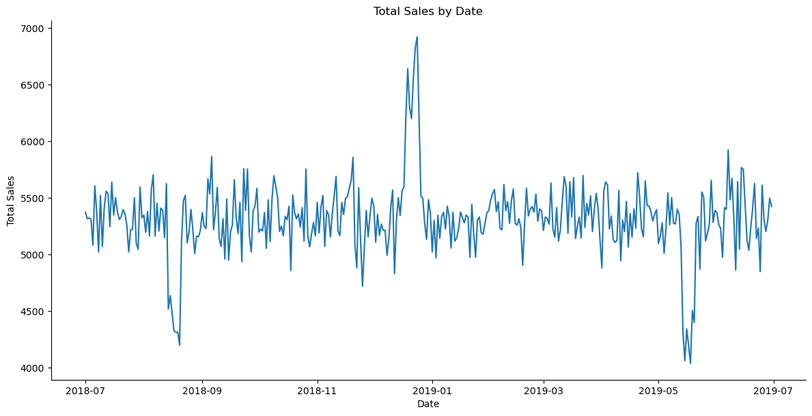
    


- There are two dips and one peak in total sales.
- Let us look deeper into these


```python
sales_by_date[sales_by_date['Total Sales'] == sales_by_date['Total Sales'].max()]
```


<div>
<style scoped>
    .dataframe tbody tr th:only-of-type {
        vertical-align: middle;
    }

    .dataframe tbody tr th {
        vertical-align: top;
    }

    .dataframe thead th {
        text-align: right;
    }
</style>
<table border="1" class="dataframe">
  <thead>
    <tr style="text-align: right;">
      <th></th>
      <th>Date</th>
      <th>Total Sales</th>
    </tr>
  </thead>
  <tbody>
    <tr>
      <th>176</th>
      <td>2018-12-24</td>
      <td>6923.0</td>
    </tr>
  </tbody>
</table>
</div>


- Sales by date were highest on `2018-12-24` which is the day before Christmas, which makes sense as a lot of people would buy Snacks for their guests, relatives or friends for Christmas.


```python
sales_by_date[sales_by_date['Total Sales'] < 4500]   ## As sales below are 4500 are mimimas
```


<div>
<style scoped>
    .dataframe tbody tr th:only-of-type {
        vertical-align: middle;
    }

    .dataframe tbody tr th {
        vertical-align: top;
    }

    .dataframe thead th {
        text-align: right;
    }
</style>
<table border="1" class="dataframe">
  <thead>
    <tr style="text-align: right;">
      <th></th>
      <th>Date</th>
      <th>Total Sales</th>
    </tr>
  </thead>
  <tbody>
    <tr>
      <th>46</th>
      <td>2018-08-16</td>
      <td>4476.60</td>
    </tr>
    <tr>
      <th>47</th>
      <td>2018-08-17</td>
      <td>4324.55</td>
    </tr>
    <tr>
      <th>48</th>
      <td>2018-08-18</td>
      <td>4312.00</td>
    </tr>
    <tr>
      <th>49</th>
      <td>2018-08-19</td>
      <td>4309.75</td>
    </tr>
    <tr>
      <th>50</th>
      <td>2018-08-20</td>
      <td>4198.20</td>
    </tr>
    <tr>
      <th>316</th>
      <td>2019-05-14</td>
      <td>4310.45</td>
    </tr>
    <tr>
      <th>317</th>
      <td>2019-05-15</td>
      <td>4060.30</td>
    </tr>
    <tr>
      <th>318</th>
      <td>2019-05-16</td>
      <td>4340.05</td>
    </tr>
    <tr>
      <th>319</th>
      <td>2019-05-17</td>
      <td>4192.45</td>
    </tr>
    <tr>
      <th>320</th>
      <td>2019-05-18</td>
      <td>4036.50</td>
    </tr>
    <tr>
      <th>322</th>
      <td>2019-05-20</td>
      <td>4396.45</td>
    </tr>
  </tbody>
</table>
</div>


- It can be observed that `Total Sales` were not that good in `Mid-August` (2019) and `Mid-May`(2018) days.
- There might be a reason for it, we will look deeper into this later.

Let's us try to answer some questions:

1. `Who spends the most on chips (total sales), describing customers by lifestage and how premium their general purchasing behaviour is?`
2. `How many customers are in each segment?`
3. `How many chips are bought per customer by segment?`
4. `What's the average chip price by customer segment?`


```python
# Let us answer first question and look more into LifeStage

filtered = df[df['Product Type'] == 'Chips']  # Only chips customers
first = pd.DataFrame(filtered.groupby(['Family and Life Stage'])['Total Sales'].sum().reset_index()
                     .sort_values(by='Total Sales', ascending=False))

colors = plt.cm.viridis(np.linspace(0, 1, len(first)))    # plt.cm.viridis colormap to create a gradient of colors for the bars

first.plot.bar(x='Family and Life Stage', y='Total Sales', fontsize='9', color=colors) 
plt.title('Total Sales by LifeStage')
```


    Text(0.5, 1.0, 'Total Sales by LifeStage')


    
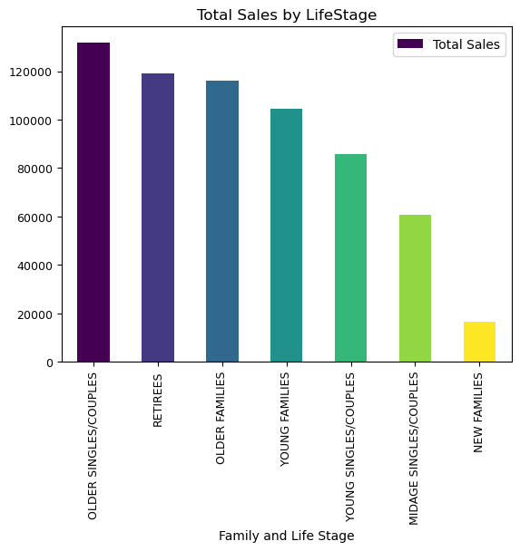
    


- `Older Couples and Singles` are doing maximum sales, followed by `Retirees` and `Older Families`
- Major sales have been done by senior customers.


```python
first = pd.DataFrame(filtered.groupby(['Shopping Behavior and Preferences'])['Total Sales'].sum().reset_index()
                     .sort_values(by='Total Sales', ascending=False))

colors = plt.cm.viridis(np.linspace(0, 1, len(first)))    # plt.cm.viridis colormap to create a gradient of colors for the bars

first.plot.bar(x='Shopping Behavior and Preferences', y='Total Sales', fontsize='9', color=colors) 
plt.title('Total Sales by Shopping Behaviour and Preferences')
```


    Text(0.5, 1.0, 'Total Sales by Shopping Behaviour and Preferences')


    
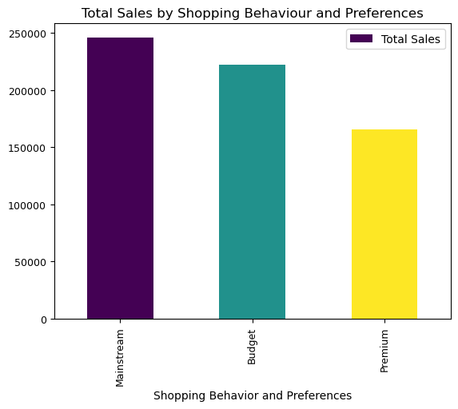
    


- `Mainstream` customers are the ones with maximum total sales followed by `Budget` and `Premium`.
- Let us combine both `Life stage` and `Shopping behaviour and Preferences` aspect.


```python
first = pd.DataFrame(filtered.groupby(['Family and Life Stage','Shopping Behavior and Preferences'])['Total Sales'].sum().reset_index()
                     .sort_values(by='Total Sales', ascending=False))

# Set the plot style
sns.set(style="whitegrid")

# Create a single plot for all 21 combinations
plt.figure(figsize=(12, 8))
ax = sns.barplot(x='Family and Life Stage', y='Total Sales', hue='Shopping Behavior and Preferences', data=first)

# Set plot labels and title
ax.set_xlabel('Family and Life Stage')
ax.set_ylabel('Total Sales')
ax.set_title('Total Sales by Lifestage by Shopping Behaviour')

# Rotate x-axis labels
plt.xticks(rotation=45)

# Show the plot
plt.legend(title='Shopping Behavior and Preferences')
plt.tight_layout()
plt.show()

```


    
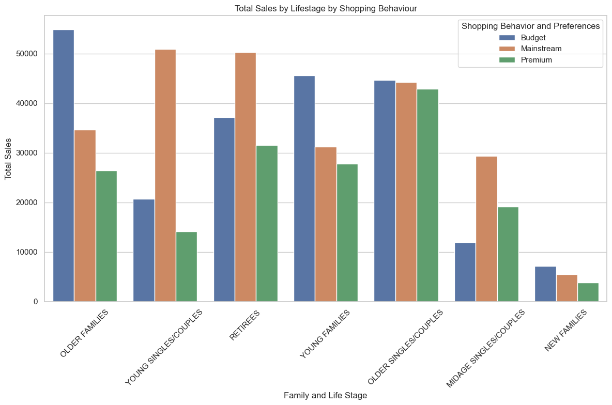
    


- Lowest `Total Sales` have been in `New Families`
- `Older Families` with `Budget` behaviour have the highest total sales, followed by `Young Singles/ Couples` in `Mainstream` shopping behaviour and `Retirees` in `Mainstream` shopping behaviour.
- `Older Singles/Couples` are the highest total sales in `Premium` shopping behaviour.


```python
## How many customers are in each segment?

filtered = df[df['Product Type'] == 'Chips']  # Only chips customers
second = pd.DataFrame(filtered.groupby(['Family and Life Stage','Shopping Behavior and Preferences']).size().reset_index(name='Count'))

# Set the plot style
sns.set(style="whitegrid")

# Create a count plot
plt.figure(figsize=(12, 8))
ax = sns.barplot(x='Family and Life Stage', y='Count', hue='Shopping Behavior and Preferences', data=second)

# Set plot labels and title
ax.set_xlabel('Family and Life Stage')
ax.set_ylabel('Number of Customers')
ax.set_title('Number of Customers by Life Stage and Shopping Behavior')

# Rotate x-axis labels
plt.xticks(rotation=45)

# Show the plot
plt.legend(title='Shopping Behavior and Preferences')
plt.tight_layout()
plt.show()

```


    
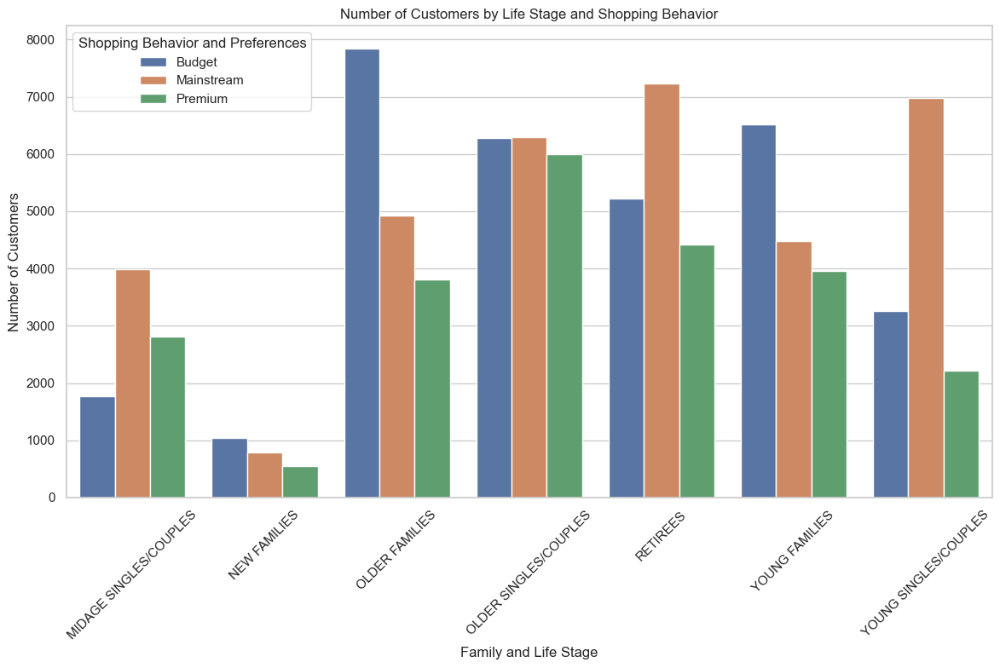
    


- Lowest `Count` have been in `New Families` which makes sense as they might not consume chips very often yet.
- `Older Families` with `Budget` behaviour have the highest count, followed by `Retirees` in `Mainstream` shopping behaviour and `Young Singles/Couples` in `Mainstream` shopping behaviour.
- `Older Singles/Couples` are the highest count in `Premium` shopping behaviour.

This is pretty similar to total sales. Let us look deeper into `Average Units per customer segment`.


```python
avg_units = df.groupby(['Family and Life Stage', 'Shopping Behavior and Preferences'])['Quantity'].sum() / df.groupby(['Family and Life Stage', 'Shopping Behavior and Preferences'])['Loyalty Card Number'].nunique()
avg_units = avg_units.reset_index()
avg_units = avg_units.rename(columns={0: 'Average'})

# Create a plot
plt.figure(figsize=(10, 6))
sns.barplot(data=avg_units, x='Family and Life Stage', y='Average', hue='Shopping Behavior and Preferences', dodge=True)
plt.xticks(rotation=90)
plt.xlabel('Lifestage')
plt.ylabel('Avg units per transaction')
plt.title('Units per customer')
plt.show()

```


    
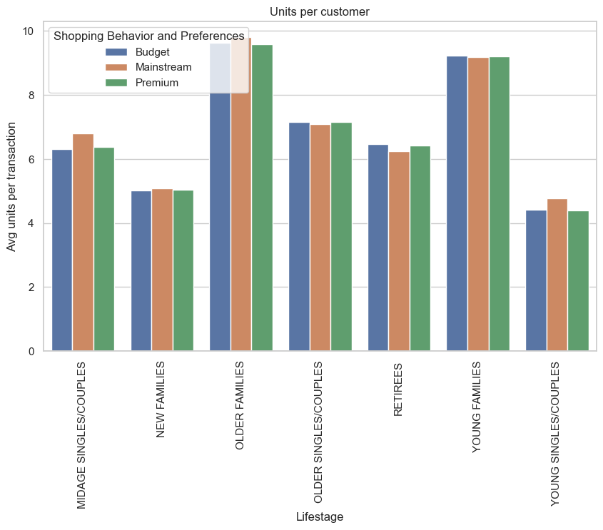
    


- `Older Families` and `Young Families` tend to buy more units of chips compared to any other segment.
- `New Families` have the lowest average units bought.


```python
avg_price = df.groupby(['Family and Life Stage', 'Shopping Behavior and Preferences'])[['Total Sales', 'Quantity']].sum()
avg_price['AVG'] = avg_price['Total Sales'] / avg_price['Quantity']
avg_price = avg_price.reset_index()

# Create a plot
plt.figure(figsize=(10, 6))
sns.barplot(data=avg_price, x='Family and Life Stage', y='AVG', hue='Shopping Behavior and Preferences', dodge=True)
plt.xticks(rotation=90)
plt.xlabel('Lifestage')
plt.ylabel('Avg price per unit')
plt.title('Price per unit')
plt.show()

```


    
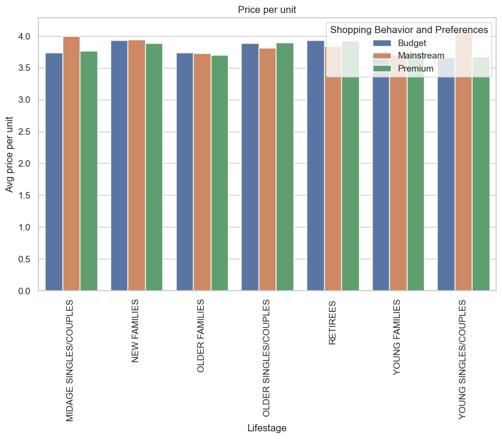
    


- `Mainstream midage` and `Mainstream young singles and couples` are more willing to pay more per packet of chips compared to their budget and premium counterparts. This may be due to premium shoppers being more likely to buy healthy snacks and when they buy chips, this is mainly for entertainment purposes rather than their own consumption.

- The above finding is also supported by there being fewer `premium midage` and ` premium young singles and couples` buying chips compared to their mainstream counterparts.

In the above visualisation, it can be observed that the difference in average price per unit is not visually very large, let us we can check if this difference is statistically different. We would be using hypothesis testing for this.


```python
# Making a new column called price per unit 
df['price_per_unit'] = df['Total Sales'] / df['Quantity']

# Define the two groups for the t-test
mainstream_group = df[(df['Family and Life Stage'].isin(["YOUNG SINGLES/COUPLES", "MIDAGE SINGLES/COUPLES"])) & (df['Shopping Behavior and Preferences'] == "Mainstream")]['price_per_unit']
other_group = df[(df['Family and Life Stage'].isin(["YOUNG SINGLES/COUPLES", "MIDAGE SINGLES/COUPLES"])) & (df['Shopping Behavior and Preferences'] != "Mainstream")]['price_per_unit']

# Perform an independent t-test with the alternative "greater"
t_stat, p_value = stats.ttest_ind(mainstream_group, other_group, alternative="greater")

print("T-statistic:", t_stat)
print("P-value:", p_value)

```

    T-statistic: 40.8341367879116
    P-value: 0.0


- t-test results in a p-value < 0.05 (our significance level).
- Hence, **The unit price for mainstream, young and mid-age singles and couples are significantly higher than that of budget or premium, young and midage singles and couples**


```python
df.columns
```


    Index(['Transaction ID', 'Loyalty Card Number', 'Family and Life Stage',
           'Date', 'Shopping Behavior and Preferences', 'Year', 'Month',
           'Day of week', 'Quarter', 'Store Number', 'Product Name', 'Quantity',
           'Total Sales', 'Brand Name', 'Flavor Description', 'Product Type',
           'Size/Weight', 'price_per_unit'],
          dtype='object')


```python
# Filtering for the "Mainstream, young singles/couples" segment
segment1 = df[(df['Family and Life Stage'] == "YOUNG SINGLES/COUPLES") & (df['Shopping Behavior and Preferences'] == "Mainstream")]

# Filtering for the "other" segment
other = df[~((df['Family and Life Stage'] == "YOUNG SINGLES/COUPLES") & (df['Shopping Behavior and Preferences'] == "Mainstream"))]

# Calculating total quantity for each segment
quantity_segment1 = segment1['Quantity'].sum()
quantity_other = other['Quantity'].sum()

# Calculating brand affinity compared to the rest of the population
quantity_segment1_by_brand = segment1.groupby('Brand Name')['Quantity'].sum().reset_index()
quantity_other_by_brand = other.groupby('Brand Name')['Quantity'].sum().reset_index()

# Merging the two DataFrames
brand_proportions = pd.merge(quantity_segment1_by_brand, quantity_other_by_brand, on='Brand Name')

# Calculating brand affinity
brand_proportions['affinityToBrand'] = brand_proportions['Quantity_x'] / quantity_segment1 / (brand_proportions['Quantity_y'] / quantity_other)

# Sorting by brand affinity
brand_proportions = brand_proportions.sort_values(by='affinityToBrand', ascending=False)

brand_proportions
```


<div>
<style scoped>
    .dataframe tbody tr th:only-of-type {
        vertical-align: middle;
    }

    .dataframe tbody tr th {
        vertical-align: top;
    }

    .dataframe thead th {
        text-align: right;
    }
</style>
<table border="1" class="dataframe">
  <thead>
    <tr style="text-align: right;">
      <th></th>
      <th>Brand Name</th>
      <th>Quantity_x</th>
      <th>Quantity_y</th>
      <th>affinityToBrand</th>
    </tr>
  </thead>
  <tbody>
    <tr>
      <th>20</th>
      <td>Tyrrells</td>
      <td>1143</td>
      <td>11155</td>
      <td>1.236230</td>
    </tr>
    <tr>
      <th>19</th>
      <td>Twisties</td>
      <td>1673</td>
      <td>16445</td>
      <td>1.227396</td>
    </tr>
    <tr>
      <th>10</th>
      <td>Kettle</td>
      <td>7172</td>
      <td>71879</td>
      <td>1.203818</td>
    </tr>
    <tr>
      <th>18</th>
      <td>Tostitos</td>
      <td>1645</td>
      <td>16489</td>
      <td>1.203633</td>
    </tr>
    <tr>
      <th>12</th>
      <td>Old El Paso</td>
      <td>1607</td>
      <td>16198</td>
      <td>1.196953</td>
    </tr>
    <tr>
      <th>13</th>
      <td>Pringles</td>
      <td>4326</td>
      <td>43693</td>
      <td>1.194531</td>
    </tr>
    <tr>
      <th>5</th>
      <td>Doritos</td>
      <td>4747</td>
      <td>49069</td>
      <td>1.167171</td>
    </tr>
    <tr>
      <th>8</th>
      <td>Grain Waves</td>
      <td>1055</td>
      <td>10907</td>
      <td>1.166997</td>
    </tr>
    <tr>
      <th>4</th>
      <td>Cobs</td>
      <td>1617</td>
      <td>16954</td>
      <td>1.150696</td>
    </tr>
    <tr>
      <th>9</th>
      <td>Infuzions</td>
      <td>2343</td>
      <td>24776</td>
      <td>1.140942</td>
    </tr>
    <tr>
      <th>17</th>
      <td>Thins</td>
      <td>2187</td>
      <td>24742</td>
      <td>1.066440</td>
    </tr>
    <tr>
      <th>3</th>
      <td>Cheezels</td>
      <td>651</td>
      <td>8096</td>
      <td>0.970137</td>
    </tr>
    <tr>
      <th>15</th>
      <td>Smiths</td>
      <td>3609</td>
      <td>56728</td>
      <td>0.767559</td>
    </tr>
    <tr>
      <th>6</th>
      <td>French Fries</td>
      <td>143</td>
      <td>2500</td>
      <td>0.690110</td>
    </tr>
    <tr>
      <th>2</th>
      <td>Cheetos</td>
      <td>291</td>
      <td>5239</td>
      <td>0.670143</td>
    </tr>
    <tr>
      <th>14</th>
      <td>Red Rock Deli</td>
      <td>1753</td>
      <td>31893</td>
      <td>0.663146</td>
    </tr>
    <tr>
      <th>11</th>
      <td>Natural Chip Co</td>
      <td>710</td>
      <td>13396</td>
      <td>0.639449</td>
    </tr>
    <tr>
      <th>1</th>
      <td>CCs</td>
      <td>405</td>
      <td>8204</td>
      <td>0.595596</td>
    </tr>
    <tr>
      <th>7</th>
      <td>Grain</td>
      <td>130</td>
      <td>2634</td>
      <td>0.595457</td>
    </tr>
    <tr>
      <th>16</th>
      <td>Sunbites</td>
      <td>230</td>
      <td>5462</td>
      <td>0.508041</td>
    </tr>
    <tr>
      <th>21</th>
      <td>Woolworths</td>
      <td>1089</td>
      <td>26767</td>
      <td>0.490852</td>
    </tr>
    <tr>
      <th>0</th>
      <td>Burger Rings</td>
      <td>106</td>
      <td>2864</td>
      <td>0.446535</td>
    </tr>
  </tbody>
</table>
</div>


- The brands with the highest brand affinity in the `Mainstream, young singles/couples` segment are `Tyrrells`, `Twisties`, and `Kettle`. 
- `Smmiths` despite being a popular brand in the general population, has a lower brand affinity within the `Mainstream, young singles/couples` segment, suggesting that it may not be the preferred choice for this specific group.

- `Mainstream young singles/couples` are `23%` more likely to purchase `Tyrrells` chips compared to the rest of the population
- `Mainstream young singles/couples` are `56%` less likely to purchase `Burger Rings` compared to the rest of the population.


```python
df.head()
```


<div>
<style scoped>
    .dataframe tbody tr th:only-of-type {
        vertical-align: middle;
    }

    .dataframe tbody tr th {
        vertical-align: top;
    }

    .dataframe thead th {
        text-align: right;
    }
</style>
<table border="1" class="dataframe">
  <thead>
    <tr style="text-align: right;">
      <th></th>
      <th>Transaction ID</th>
      <th>Loyalty Card Number</th>
      <th>Family and Life Stage</th>
      <th>Date</th>
      <th>Shopping Behavior and Preferences</th>
      <th>Year</th>
      <th>Month</th>
      <th>Day of week</th>
      <th>Quarter</th>
      <th>Store Number</th>
      <th>Product Name</th>
      <th>Quantity</th>
      <th>Total Sales</th>
      <th>Brand Name</th>
      <th>Flavor Description</th>
      <th>Product Type</th>
      <th>Size/Weight</th>
    </tr>
  </thead>
  <tbody>
    <tr>
      <th>0</th>
      <td>1</td>
      <td>1000</td>
      <td>YOUNG SINGLES/COUPLES</td>
      <td>2018-10-17</td>
      <td>Premium</td>
      <td>2018</td>
      <td>October</td>
      <td>Wednesday</td>
      <td>4</td>
      <td>1</td>
      <td>Natural Chip        Compny SeaSalt175g</td>
      <td>2</td>
      <td>6.0</td>
      <td>Natural Chip Co</td>
      <td>Other</td>
      <td>Chips</td>
      <td>175g</td>
    </tr>
    <tr>
      <th>1</th>
      <td>348</td>
      <td>1307</td>
      <td>MIDAGE SINGLES/COUPLES</td>
      <td>2019-05-14</td>
      <td>Budget</td>
      <td>2019</td>
      <td>May</td>
      <td>Tuesday</td>
      <td>2</td>
      <td>1</td>
      <td>CCs Nacho Cheese    175g</td>
      <td>3</td>
      <td>6.3</td>
      <td>CCs</td>
      <td>Nacho Cheese</td>
      <td>Other</td>
      <td>175g</td>
    </tr>
    <tr>
      <th>2</th>
      <td>383</td>
      <td>1343</td>
      <td>MIDAGE SINGLES/COUPLES</td>
      <td>2019-05-20</td>
      <td>Budget</td>
      <td>2019</td>
      <td>May</td>
      <td>Monday</td>
      <td>2</td>
      <td>1</td>
      <td>Smiths Crinkle Cut  Chips Chicken 170g</td>
      <td>2</td>
      <td>2.9</td>
      <td>Smiths</td>
      <td>Chips Chicken</td>
      <td>Chips</td>
      <td>170g</td>
    </tr>
    <tr>
      <th>3</th>
      <td>974</td>
      <td>2373</td>
      <td>MIDAGE SINGLES/COUPLES</td>
      <td>2018-08-17</td>
      <td>Budget</td>
      <td>2018</td>
      <td>August</td>
      <td>Friday</td>
      <td>3</td>
      <td>2</td>
      <td>Smiths Chip Thinly  S/Cream&amp;Onion 175g</td>
      <td>5</td>
      <td>15.0</td>
      <td>Smiths</td>
      <td>Other</td>
      <td>Chips</td>
      <td>175g</td>
    </tr>
    <tr>
      <th>4</th>
      <td>1038</td>
      <td>2426</td>
      <td>MIDAGE SINGLES/COUPLES</td>
      <td>2018-08-18</td>
      <td>Budget</td>
      <td>2018</td>
      <td>August</td>
      <td>Saturday</td>
      <td>3</td>
      <td>2</td>
      <td>Kettle Tortilla ChpsHny&amp;Jlpno Chili 150g</td>
      <td>3</td>
      <td>13.8</td>
      <td>Kettle</td>
      <td>Tortilla ChpsHny&amp;Jlpno Chili</td>
      <td>Tortilla</td>
      <td>150g</td>
    </tr>
  </tbody>
</table>
</div>


```python
popular_brand = pd.DataFrame(df['Brand Name'].value_counts().reset_index().rename(columns={'index':'Brand Name', 'Brand Name':'Count'}))

colors = plt.cm.viridis(np.linspace(0, 1, len(popular_brand)))    # plt.cm.viridis colormap to create a gradient of colors for the bars

plt.figure(dpi=1000)
popular_brand.plot.bar(x='Brand Name', y='Count', fontsize='9', color=colors) 
plt.title('Popular Brands on Count')
```


    Text(0.5, 1.0, 'Popular Brands on Count')


    <Figure size 6400x4800 with 0 Axes>


    
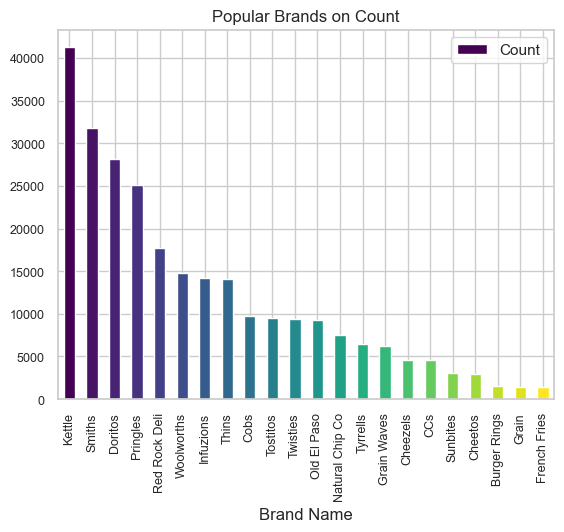
    


- `Kettle` is the most popular brand on the basis of counts, followed by `Smiths`, `Pringles` and `Doritos`


```python
most_sold_brands = pd.DataFrame(df.groupby('Brand Name')['Quantity'].sum().reset_index()).sort_values(by='Quantity', ascending=False)


colors = plt.cm.magma(np.linspace(0, 1, len(most_sold_brands)))    # plt.cm.viridis colormap to create a gradient of colors for the bars

plt.figure(dpi=1000)
most_sold_brands.plot.bar(x='Brand Name', y='Quantity', fontsize='9', color=colors) 
plt.title('Most sold brands')
```


    Text(0.5, 1.0, 'Most sold brands')


    <Figure size 6400x4800 with 0 Axes>


    
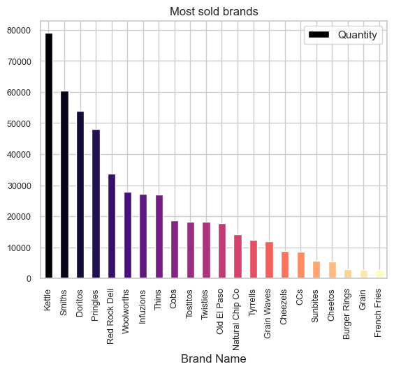
    


- `Kettle` is the most popular brand on the basis of quantities, followed by `Smiths`, `Pringles` and `Doritos`
- Basically, there is `similar pattern in number of quantities sold as well as brand popularity`.

Let us see if similar pattern follows in total sales too.


```python
most_sales_brands = pd.DataFrame(df.groupby('Brand Name')['Total Sales'].sum().reset_index()).sort_values(by='Total Sales', ascending=False)

colors = plt.cm.magma(np.linspace(0, 1, len(most_sales_brands)))    # plt.cm.viridis colormap to create a gradient of colors for the bars

plt.figure(dpi=1000)
most_sales_brands.plot.bar(x='Brand Name', y='Total Sales', fontsize='9', color=colors) 
plt.title('Highest Total Sales brands')
```


    Text(0.5, 1.0, 'Highest Total Sales brands')


    <Figure size 6400x4800 with 0 Axes>


    
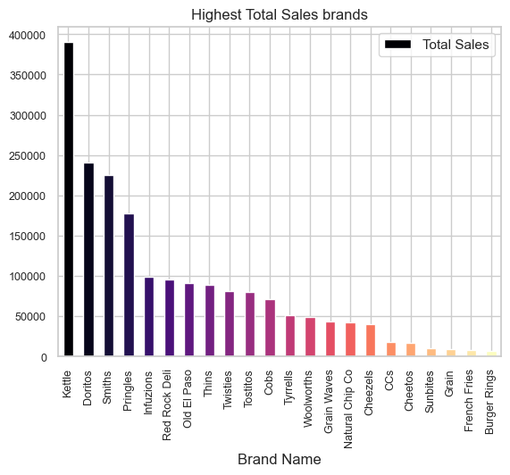
    


- `Kettle` is the most popular brand on the basis of quantities sold, total sales and popularity, followed by `Smiths`, `Pringles` and `Doritos`


```python
df.columns
```


    Index(['Transaction ID', 'Loyalty Card Number', 'Family and Life Stage',
           'Date', 'Shopping Behavior and Preferences', 'Year', 'Month',
           'Day of week', 'Quarter', 'Store Number', 'Product Name', 'Quantity',
           'Total Sales', 'Brand Name', 'Flavor Description', 'Product Type',
           'Size/Weight'],
          dtype='object')


```python
weekly_sales = pd.DataFrame(df.groupby(['Day of week'])['Total Sales'].sum().reset_index()).sort_values(by='Total Sales', ascending=False)
pd.set_option('display.max_rows', None)  # Set the option to display all rows
print(weekly_sales)
pd.reset_option('display.max_rows')  # Reset the option to its default value
```

      Day of week  Total Sales
    3      Sunday    282579.10
    0      Friday    279521.30
    6   Wednesday    277876.40
    2    Saturday    275612.60
    1      Monday    274309.95
    4    Thursday    272565.65
    5     Tuesday    270644.00


- There is `no significant difference in average total sales in any day of week`.
- Similar is true for `Total Sales` of any day of week.


```python
popular_product_type = pd.DataFrame(df['Product Type'].value_counts().reset_index()).rename(columns={'index':'Product Type', 'Product Type':'Count'})

colors = plt.cm.magma(np.linspace(0, 1, len(popular_product_type)))    # plt.cm.viridis colormap to create a gradient of colors for the bars

plt.figure(dpi=1000)
popular_product_type.plot.bar(x='Product Type', y='Count', fontsize='9', color=colors) 
plt.title('Popular Product Types')
```


    Text(0.5, 1.0, 'Popular Product Types')


    <Figure size 6400x4800 with 0 Axes>


    
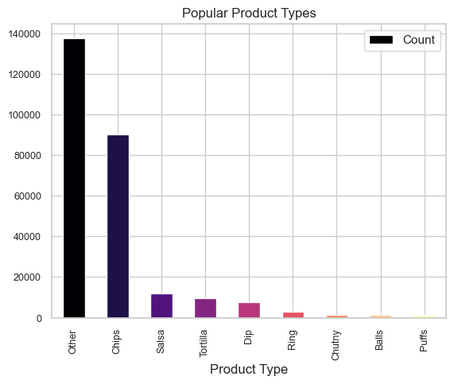
    


- In the named product types, `Chips` is the most popular followed by `Salsa` and `Tortilla`


```python
df.head()
```


<div>
<style scoped>
    .dataframe tbody tr th:only-of-type {
        vertical-align: middle;
    }

    .dataframe tbody tr th {
        vertical-align: top;
    }

    .dataframe thead th {
        text-align: right;
    }
</style>
<table border="1" class="dataframe">
  <thead>
    <tr style="text-align: right;">
      <th></th>
      <th>Transaction ID</th>
      <th>Loyalty Card Number</th>
      <th>Family and Life Stage</th>
      <th>Date</th>
      <th>Shopping Behavior and Preferences</th>
      <th>Year</th>
      <th>Month</th>
      <th>Day of week</th>
      <th>Quarter</th>
      <th>Store Number</th>
      <th>Product Name</th>
      <th>Quantity</th>
      <th>Total Sales</th>
      <th>Brand Name</th>
      <th>Flavor Description</th>
      <th>Product Type</th>
      <th>Size/Weight</th>
    </tr>
  </thead>
  <tbody>
    <tr>
      <th>0</th>
      <td>1</td>
      <td>1000</td>
      <td>YOUNG SINGLES/COUPLES</td>
      <td>2018-10-17</td>
      <td>Premium</td>
      <td>2018</td>
      <td>October</td>
      <td>Wednesday</td>
      <td>4</td>
      <td>1</td>
      <td>Natural Chip        Compny SeaSalt175g</td>
      <td>2</td>
      <td>6.0</td>
      <td>Natural Chip Co</td>
      <td>Other</td>
      <td>Chips</td>
      <td>175g</td>
    </tr>
    <tr>
      <th>1</th>
      <td>348</td>
      <td>1307</td>
      <td>MIDAGE SINGLES/COUPLES</td>
      <td>2019-05-14</td>
      <td>Budget</td>
      <td>2019</td>
      <td>May</td>
      <td>Tuesday</td>
      <td>2</td>
      <td>1</td>
      <td>CCs Nacho Cheese    175g</td>
      <td>3</td>
      <td>6.3</td>
      <td>CCs</td>
      <td>Nacho Cheese</td>
      <td>Other</td>
      <td>175g</td>
    </tr>
    <tr>
      <th>2</th>
      <td>383</td>
      <td>1343</td>
      <td>MIDAGE SINGLES/COUPLES</td>
      <td>2019-05-20</td>
      <td>Budget</td>
      <td>2019</td>
      <td>May</td>
      <td>Monday</td>
      <td>2</td>
      <td>1</td>
      <td>Smiths Crinkle Cut  Chips Chicken 170g</td>
      <td>2</td>
      <td>2.9</td>
      <td>Smiths</td>
      <td>Chips Chicken</td>
      <td>Chips</td>
      <td>170g</td>
    </tr>
    <tr>
      <th>3</th>
      <td>974</td>
      <td>2373</td>
      <td>MIDAGE SINGLES/COUPLES</td>
      <td>2018-08-17</td>
      <td>Budget</td>
      <td>2018</td>
      <td>August</td>
      <td>Friday</td>
      <td>3</td>
      <td>2</td>
      <td>Smiths Chip Thinly  S/Cream&amp;Onion 175g</td>
      <td>5</td>
      <td>15.0</td>
      <td>Smiths</td>
      <td>Other</td>
      <td>Chips</td>
      <td>175g</td>
    </tr>
    <tr>
      <th>4</th>
      <td>1038</td>
      <td>2426</td>
      <td>MIDAGE SINGLES/COUPLES</td>
      <td>2018-08-18</td>
      <td>Budget</td>
      <td>2018</td>
      <td>August</td>
      <td>Saturday</td>
      <td>3</td>
      <td>2</td>
      <td>Kettle Tortilla ChpsHny&amp;Jlpno Chili 150g</td>
      <td>3</td>
      <td>13.8</td>
      <td>Kettle</td>
      <td>Tortilla ChpsHny&amp;Jlpno Chili</td>
      <td>Tortilla</td>
      <td>150g</td>
    </tr>
  </tbody>
</table>
</div>


```python
# Set the figure size and DPI
plt.figure(figsize=(10, 6), dpi=500)

# Create a histogram using Matplotlib
sns.histplot(df['Size/Weight'], kde=False)  # You can enable the KDE for a smoother distribution curve

# Customize the plot appearance
plt.title('Distribution of Size/Weight')
plt.xlabel('Size/Weight')
plt.ylabel('Frequency')
plt.xticks(rotation=45)
plt.grid(True, linestyle='--', alpha=0.7)

# Show the plot
plt.show()

```


    
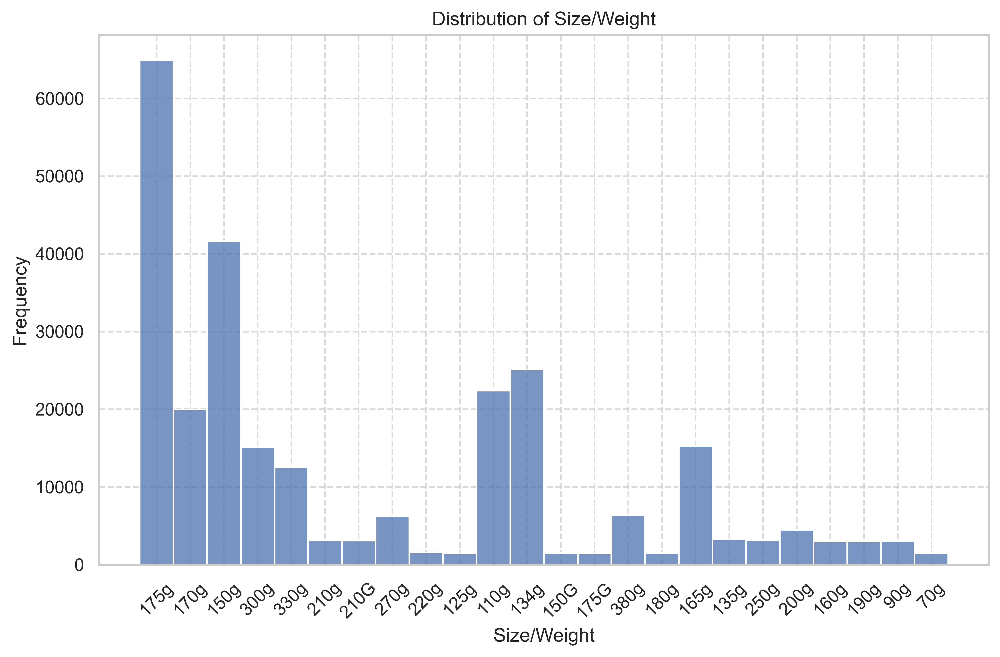
    


- `175g` packets are the most frequent, followed by `150g`, `134g` and `110g`


```python
# Set the figure size and style
plt.figure(figsize=(10, 6))
sns.set(style="whitegrid")

# Create a count plot with "Size/Weight" on the x-axis and hue by "Shopping behavior and Preferences"
sns.countplot(x='Size/Weight', hue='Shopping Behavior and Preferences', data=df)

# Customize the plot appearance
plt.title('Distribution of Size/Weight by Shopping Behavior and Preferences')
plt.xlabel('Size/Weight')
plt.ylabel('Count')

# Rotate x-axis labels for better visibility
plt.xticks(rotation=45)

# Show the plot
plt.legend(title='Shopping Behavior and Preferences')
plt.tight_layout()
plt.show()

```


    
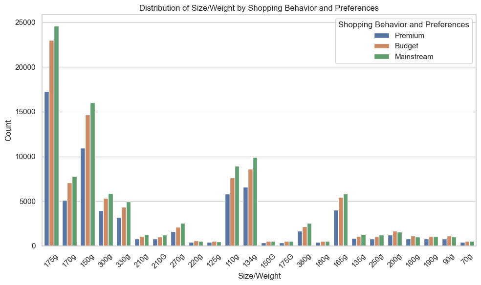
    


- `175g` is the most popular `Size/Weight` in all Shopping Behaviour and Preferences.


```python
df[df['Size/Weight'] == '270g']['Brand Name'].value_counts()
```


    Twisties    6285
    Name: Brand Name, dtype: int64


- `Twisties` is the only brand offering `270g` packets.


```python
df[df['Size/Weight'] == '270g']['Shopping Behavior and Preferences'].value_counts(normalize=True)*100
```


    Mainstream    40.461416
    Budget        33.937947
    Premium       25.600636
    Name: Shopping Behavior and Preferences, dtype: float64


- `Mainstream` customers are the highest buyers of `Twisties` brand making them more likely buyers of `270g` packets.

<div style="text-align:center; background-color:#add8e6; padding:10px; border-radius:5px;">
    <h2 style="color:#000;">Sales Analysis and Marketing Insights</h2>
</div>

## Sales Drivers

- The primary drivers of sales in the market are the "Budget - older families," "Mainstream - young singles/couples," and "Mainstream - retirees" shoppers.

## High Spending Segments

- The higher spending on chips within the market is primarily due to the larger population sizes of "Mainstream - young singles/couples" and "Mainstream - retirees" segments. These segments have more buyers.

## Higher Price per Packet

- "Mainstream - midage" and "young singles and couples" segments exhibit a tendency to pay more per packet of chips, which suggests a strong inclination towards impulse buying behavior.

## Impulse Buying Indication

- The higher price per packet observed in the "Mainstream - midage" and "young singles and couples" segments provides a clear indication of impulse buying behavior among these consumer groups.

## Tyrrells Preference

- "Mainstream - young singles and couples" stand out as they are 23% more likely to purchase Tyrrells chips compared to the rest of the population.

## Marketing Strategy Suggestion

- To enhance the category's performance, it is suggested that the Category Manager consider strategically placing Tyrrells and smaller packs of chips in discretionary spaces near segments where young singles and couples frequent more often. This approach can increase visibility and encourage impulse buying behavior.


This summary highlights the key insights derived from the sales analysis, providing valuable information for the Category Manager to optimize marketing strategies and boost sales in the market.


```python

```
